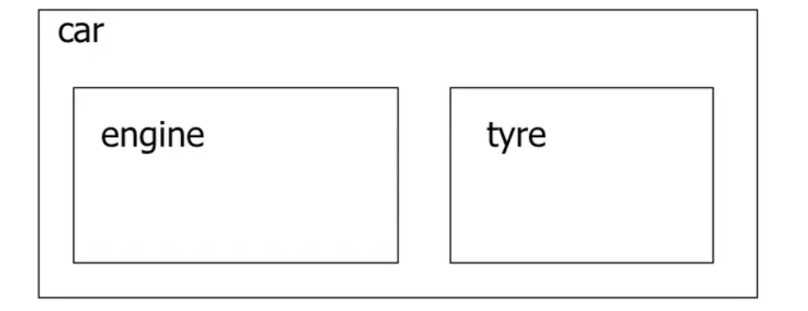
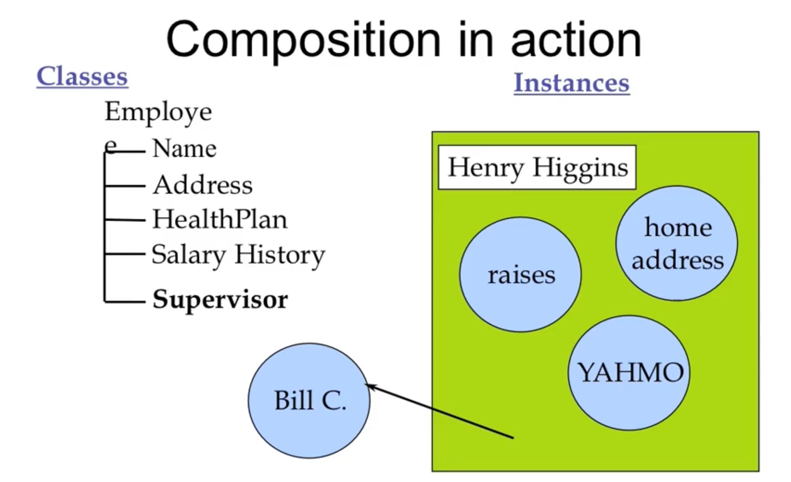

# Reusing the implementation

- Composition: construct new object with existing objects
- It is the relationship of "has-a"




OOP: 三大特性：封装， 继承， 多态性

继承， 是软件重用， 代码重用。

继承是OOP对软件重用的回答， 继承是OOP实现软件重用的方式。


# Composition

- Objects can be used to build up other objects

- Ways of inclusion

  - Fully (就是那个对象是此对象的一部分) （即， 成员变量就是对象本身）
  - By reference （知道那个在哪里， 也可以调用它，但是这个不是该对象的一部分），（即， 成员变量就是指针）

- Inclusion by reference allows sharing

- For example, an Employee has a 

  - Name 
  - Address
  - Health Plan
  - Salary History
    - Collection of Raise objects
  - Supervisor
    - Another Employee object!

  

  内存模型，就是什么东西在哪里，这就是内存模型。

  Name, Address, Health Plan, Salary History, 这些都是Fully inclusion, 属于它自身的

  Supervisor， 这个就可以是Reference

  从语义上说就比较合理

  

   


# Embedded objects

- All embedded objects are initialized

  - The default constructor is called if

    - you do not supply the arguments, and there is a default constructor (or one can be built)
  
- Constructors can have initialization list
  - any number of objects separated by commas
  - is optional
  - Provide arguments to sub-constructors
  
- Syntax:

  ```c++
  name( args ) [':' init-list] '{'
  ```


# Public vs. Privare

- It is common to make embedded objects

​	private:

​         -  they are part of the underlying implementation

​		 -  the new class only has part of the public interface of the old class

  - Can embed as a public object if you want to have the entire public interface of the subobject available in the new object:

    


