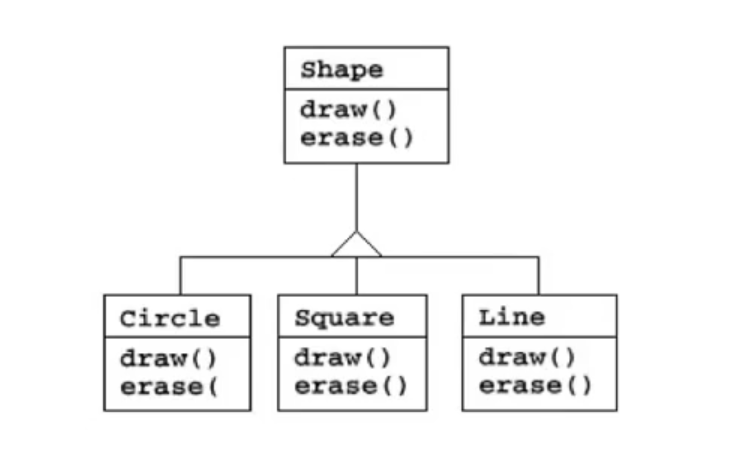
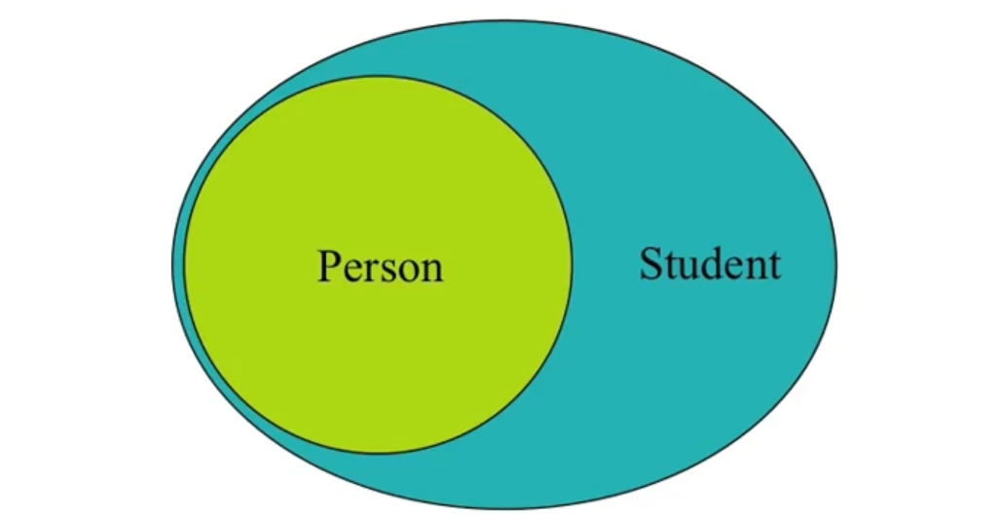
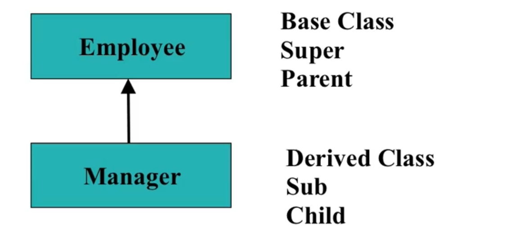
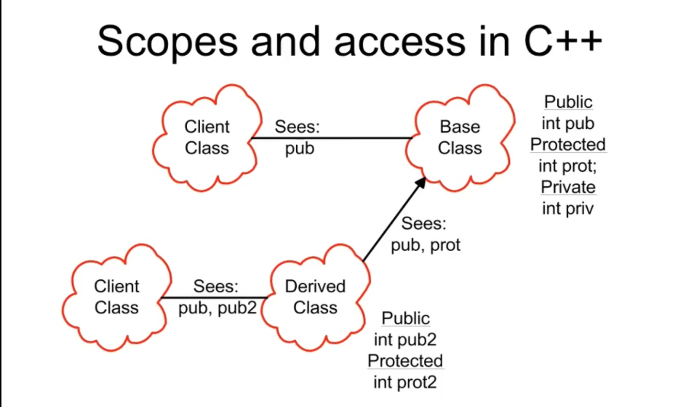

# Reusing the interface

- Inheritance is to take the existing class, clone it, and then make additions and modifications to the clone.

  

组合： 拿已有的对象， 拼装成一个新的对象， （实的）

继承：拿已有的类来， 改造成一个新的类


# Inheritance

- Language implementation technique

- Also an important component of the OO design methodology

- Allows sharing of design for

  -  Member data
  -  Member functions
  -  Interfaces (指一个类中对外公开的东西,别人可以通过Interface来操纵那些的说, 这些都是interface)

- Key technology in C++

- The ability to define the behavior or implementation of one class as a **superset** of another class

  继承一个类的时候, 一般会对该类进行扩充.

  

  A student is a Person. Student 继承了 Person, 所以Person是地位比Student高的.

- Class relationship: Is-A

  Manager is an employee. 
  
  

```c++
#include <iostream>
using namespace std;

class A
{
        public:
                A()
                {
                        cout << "A::A()" << endl;
                }

                ~A()
                {
                        cout << "A::~A()" << endl;
                }
                void print()
                {
                        cout << "A::print(): i = " << i << endl;
                }
    	protected:
    			void set(int val)
                {
                    i = val;
                }
        private:
                int i;
};

class B: public A
{
        public:
                void f() 
                {
                        set(20);
                    //  i = 10; // Error! 是父类私有的变量， 子类不可以直接更改变动， 可以通过一定的规则去使用它，比如通过父类里面相应的函数
                        print();        
                };      
};

int main()
{
        B b;
        // b.set(10);    // protected只能由它自身和子类进行调用， 其余的地方不能使用, 所以main()里面是不能调用的说
 // inheritance.cpp: In function ‘int main()’:
 // inheritance.cpp:18:8: error: ‘void A::set(int)’ is protected
 // void set(int val)
 //       ^
 //inheritance.cpp:47:10: error: within this context

        b.print();
        b.f();
		
    	return 0;
}
```


`protected` 是一种访问属性, 意味着只有它和它的子类可以访问. 其他地方就不可以访问了。 比如main() 内就不可以的说。


`public` , `private`, `protected`, 这三个的规划的说

1. 首先, 我们会让我们所有的数据都是**private**, 依然坚持这一点
2. 然后, 真的让所有人都用的是**public**
3. 留一些**protected**的接口给子类， **protected**是让子类可以操作， 其他的不可以操作


