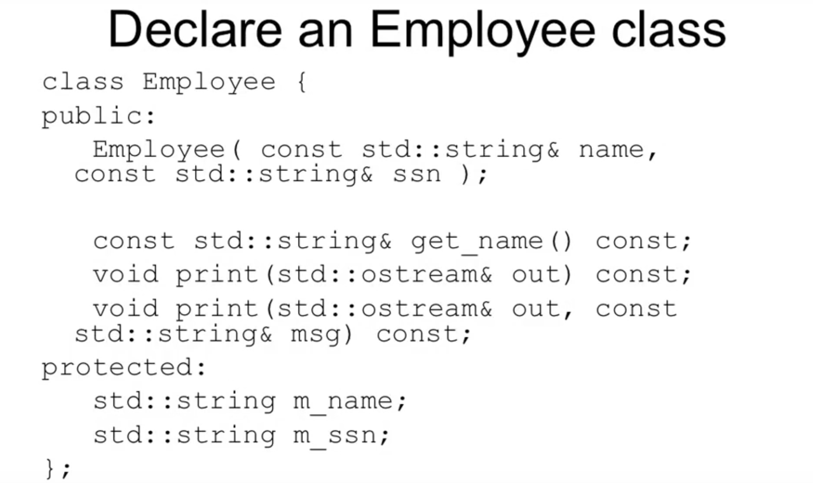
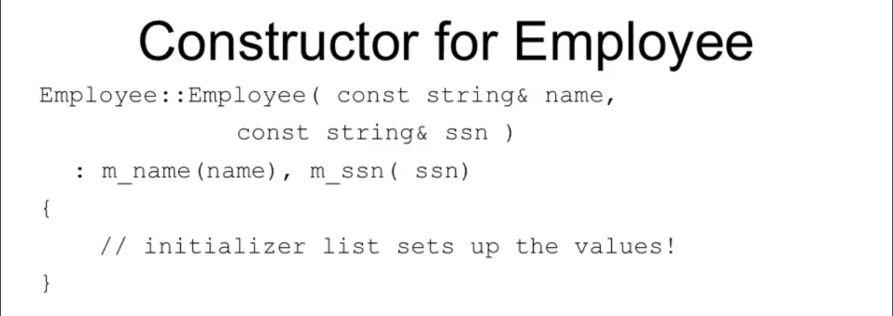
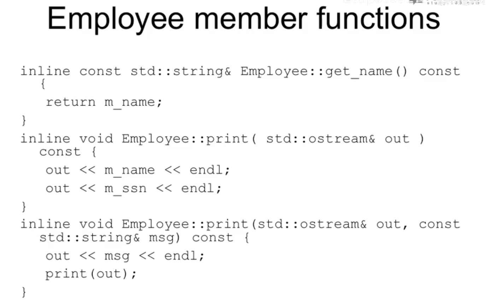
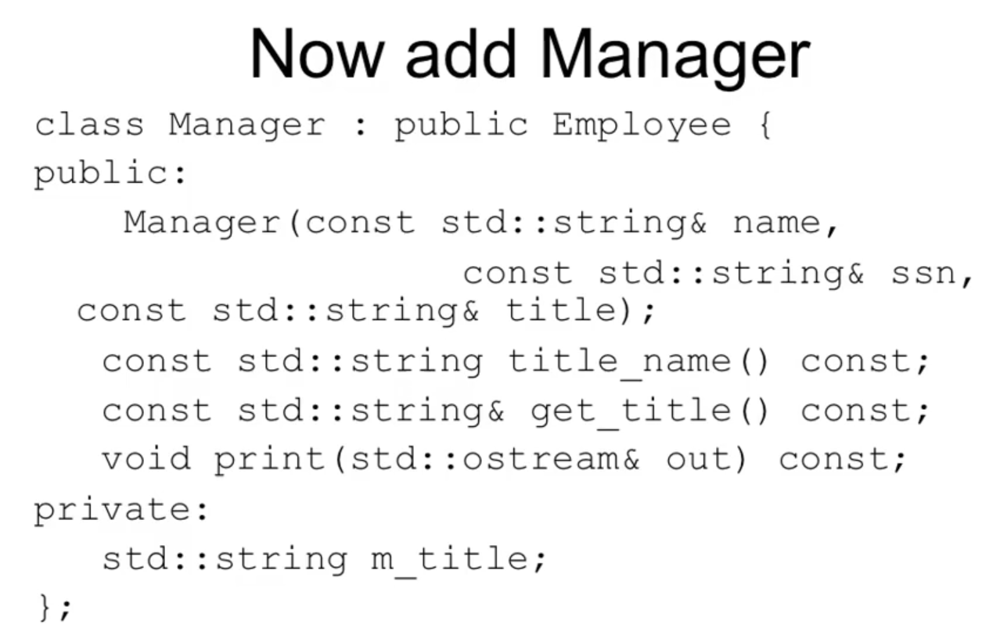
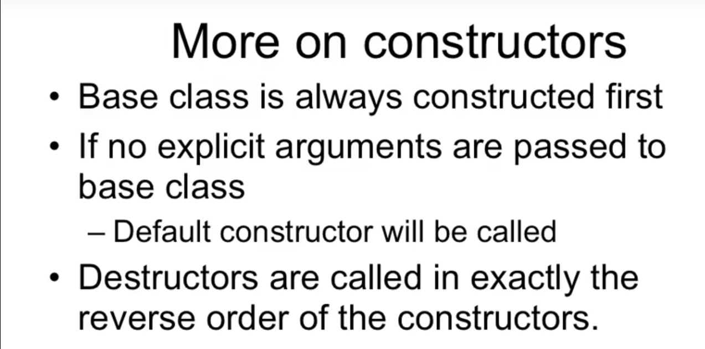
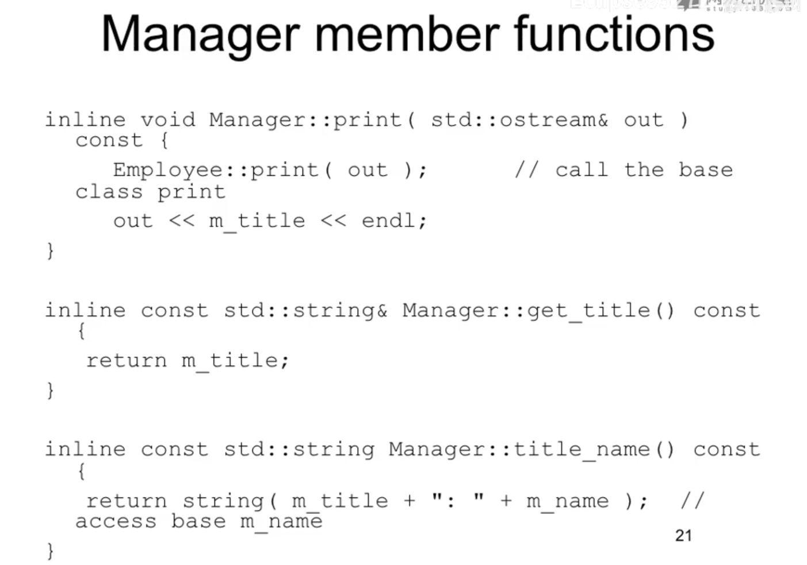
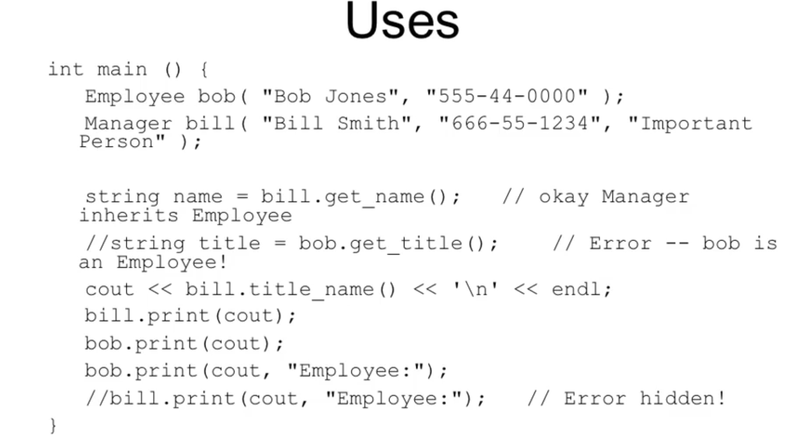

# Declare an Employee class

```c++
class Employee
{
    public:
    	Employee();
};
```




**private**: 就是我们想保持我们自己对于m_name, m_ssn的设计, 如果设计成`protected`, 好处是子类可以直接访问, 坏处就是你不能知道子类会拿m_name, m_ssn做什么.






重载overload, 就是两个函数名字相同, 但是参数不同, 这就是overload. ;)

尽量利用已经写好的代码, 而不是同样的代码到处都有. avoid code duplication



这个Manager类里面的print() 和 父类Employee里面的print()是一样的, 需要注意是否有问题的说.

我们创建一个子类的对象的时候, 它的父类的构造函数是会被调用的.

然后Employee是没有default constructor的.


**Manager**类的对象里面有**Employee**的body. 继承了你的父类就意味着你的体内有你的父类的东西.


关于子类的initializer, 自己所有的成员变量的初始化和父类的构造函数的调用也必须放到那里. 其中的顺序是先初始化父类的构造函数, 然后再进行子类的成员变量的初始化 (与成员变量和父类构造函数在此处的写的前后顺序无关).




构造的时候, 先是父类进行构造, 析构的时候, 先是子类被析构.



**::** 是解析符, 表示这个是谁的.



对C++来说, 当子类和父类出现同名的函数的时候, C++会将父类的所有的同名的函数都隐藏掉, 只剩下子类的函数, 只有C++这么干, 其余的OOP语言都不这样干的说.

C++为什么这么干呢? 这个和另一件事情只有C++这么干有关.

对于C++来说, 该同名的子类的函数和父类的函数没有关系, 只是碰巧名字相同罢了. 因为如此, 所以其他的整个都没有关系. 而其他的OOP语言会认为这个是函数的重载
