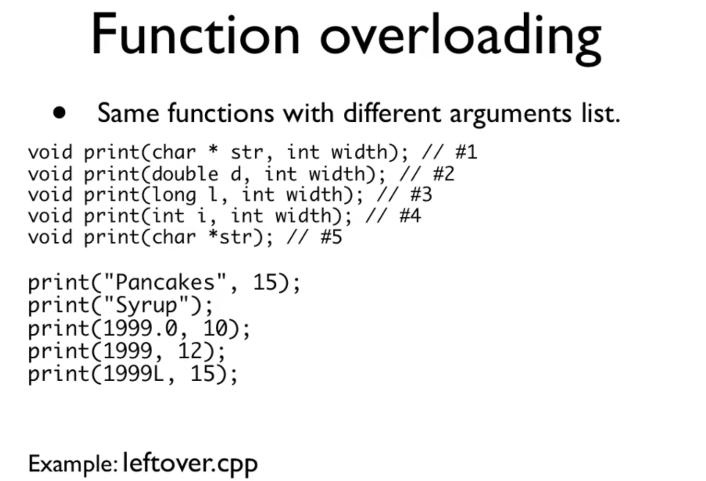
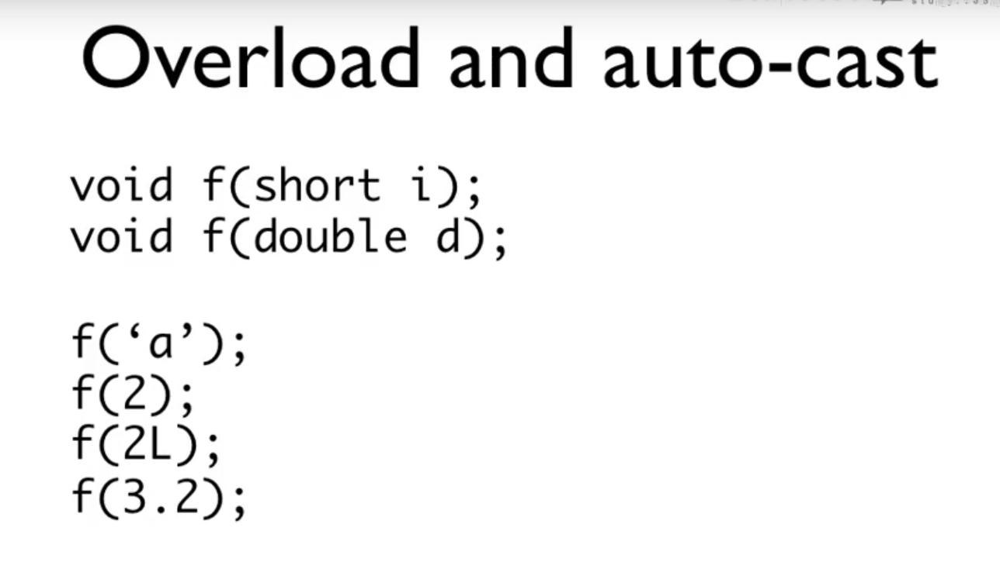
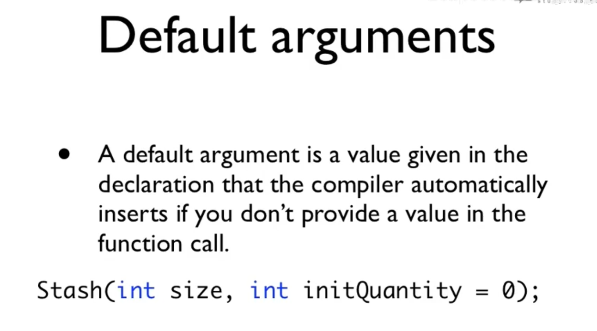
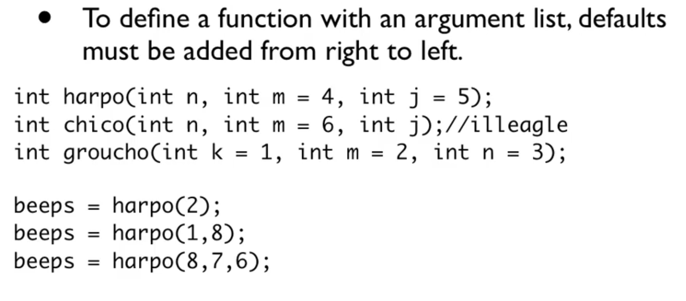
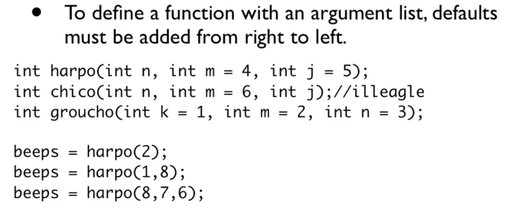

对于C++来说, 该同名的子类的函数和父类的函数没有关系, 只是碰巧名字相同罢了. 因为如此, 所以其他的整个都没有关系. 而其他的OOP语言会认为这个是函数的重载





函数重载, 是认为一些函数拥有相同的函数名, 但是有不同的参数列表(参数个数, 参数类型), 但是返回类型相同.  如果返回类型不同, 编译器不知道你调用的是哪一个的说, 这个是不可行的说.







函数声明如果有default argument的话, 要从右到左, 保证都有赋值, 不能够有空缺, 否则会有报错.




default arguments 是编译时就知道了的, 和运行时刻没有什么关系, 也就是说, 函数参数个数和类型不变, 只是编译器根据default vales来补上相应的值.


可以在头文件那边写, 也可以在调用的地方你自己写一下的说. 效果一样.
main.cpp

```c++
//#include "default_value.h"
void f(int i, int j = 3456);

int main()
{
        f(233);
        f(233, 666);
        return 0;
}
```

default_value.h

```c++
#ifndef __DEFAULT_H__
#define __DEFAULT_H__
int f(int a, int b = 255);
#endif
```

default_value.cpp

```c++
#include "default_value.h"
#include <iostream>
using namespace std;

int f(int a, int b)
{
        cout << "a = " << a << ", " 
             << "b = " << b << "." << endl;
}
```

```
g++ main.cpp default_value.cpp
```

注意点:基本上个不建议使用default value, 影响代码阅读