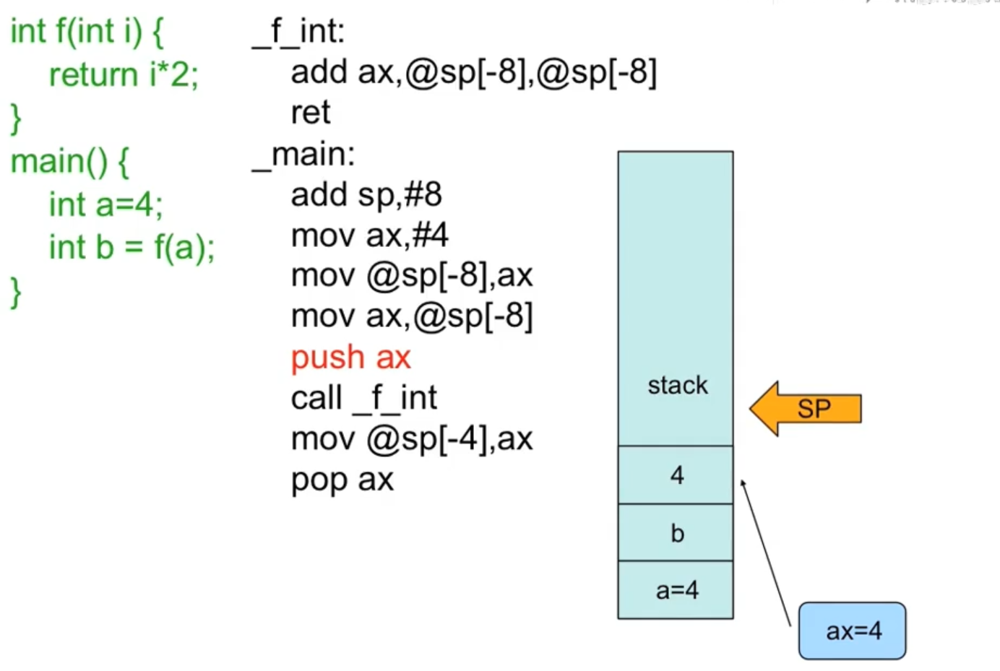
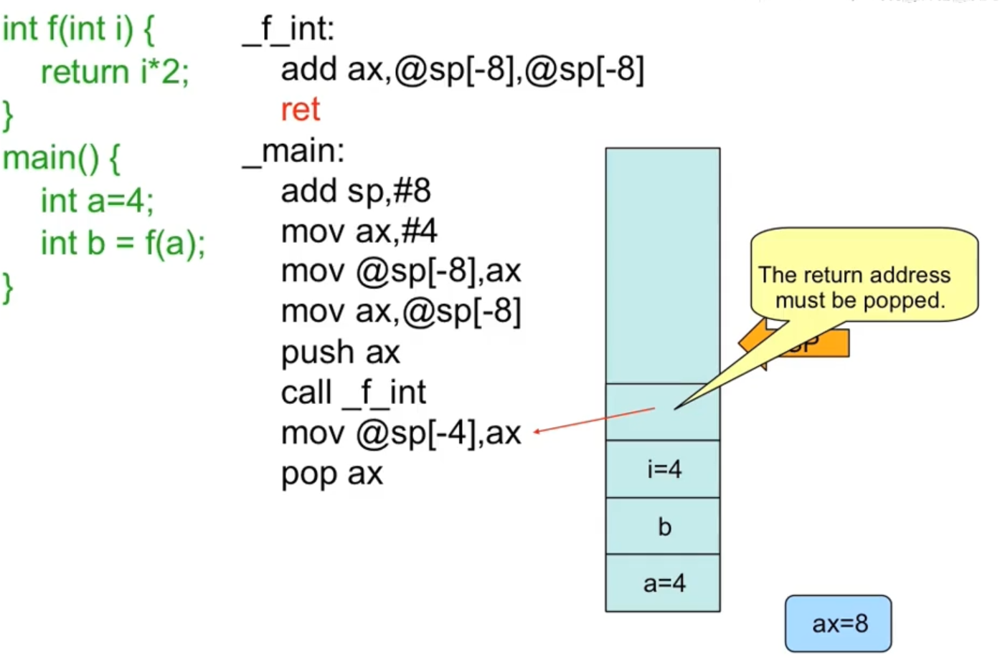
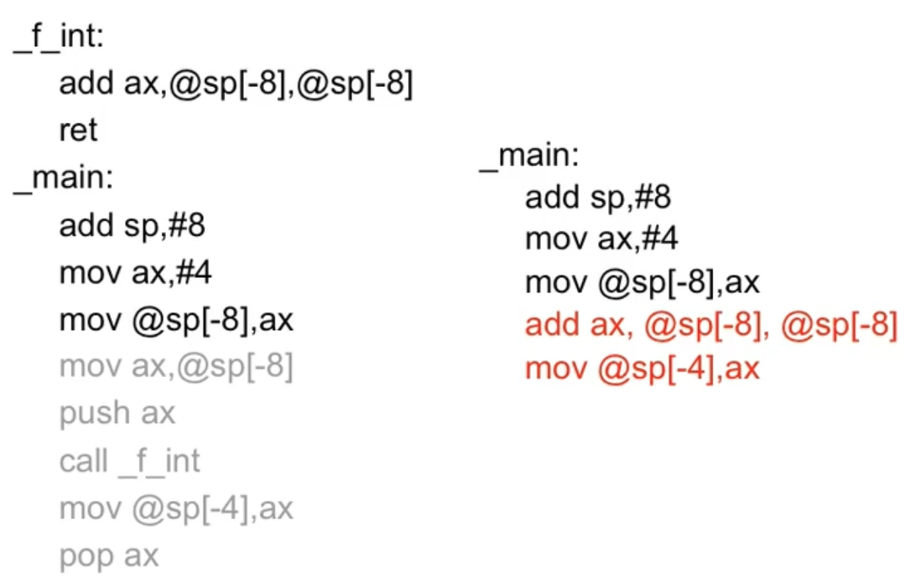

# Overhead for a function call

overhead means "额外的开销"

- the processing time required by a device prior to the execution of a command

  - Push parameters
  - Push return address
  - Prepare return values
  - Pop all pushed

  

  函数调用的额外开销

  

  **sp**是一个寄存器, 这个寄存器是stack pointer (sp) 堆栈指针, 

  在程序运行过程中, 每一个程序有一个独立的堆栈, 一般放的是本地变量和调用的函数的返回地址





# Inline Functions

- An inline function is expanded in place, like a preprocessor macro, so the overhead of the function call is eliminated.

Compared with the inline functions:



inline functions 都不会在最终的可执行文件中，inline functions会进行替换的说， 直接插入到相应的地方

inline function 不会去真的去做那些push return move等等的动作，而是把函数的代码嵌入到相应的地方去， 但是仍会保留函数的独立的空间。

```c++
inline int plusOne(int x);
inline int plusOne(int x) {return ++x;};
```


- Repeat **inline** keyword at declaration and definition.
  - .h 是给调用的地方看的
  - .cpp是用来产生这个函数的
  - .h的inline是用来告诉调用到的这个函数是inline的， 就是说不能生成调用的代码， 而应该把函数的body给插过来
  - .cpp的inline是用来告诉产生的这个函数就是inline函数， 否则在产生的时候，就会真的在编译的时候留下相应的空白

- An inline function definition may not generate any code in .obj file.


编译器同一个时间， 只能看见一个文件。 


main.cpp

```c++
#include "inline_function.h"

int main()
{
        f(233, 666);
        return 0;
}
```


inline_function.h

```c
#ifndef __INLINE_FUNCTION_H__
#define __INLINE_FUNCTION_H__
inline void f(int i, int j);
#endif
```


inline_function.cpp

```c
#include "inline_function.h"
#include <iostream>
using namespace std;

inline void f(int i, int j)
{
        cout << i << " " << j << endl;
}
```


```c
g++ main.cpp inline_function.cpp --save-temps
```

result:

```c++
In file included from main.cpp:1:0:
inline_function.h:3:13: warning: inline function ‘void f(int, int)’ used but never defined [enabled by default]
 inline void f(int i, int j);
             ^
main.o: In function `main':
main.cpp:(.text+0xf): undefined reference to `f(int, int)'
collect2: error: ld returned 1 exit status
```


编译器一次只能看见一个的说， 所以的话， 有问题啦， main.s还是在调用函数啦， call _Z1fii 啦， 其余的话，好像还有什么别的啦，再说啦， 还有一个的话， 应该是这样的啦， 比如说，main.ii 的话， 就只有inline 函数的声明咯。看不见定义的说咯。

因为inline_function.h 和 inline_function.cpp的话呢， 正好都有inline 关键字啦， 所以不会生成相应的.o的东东啦， 在main.o 和 inline_function.o进行链接的时候， 就仍然找不到那个函数咯， 然后就报错咯


更改:

将inline_function.h中, 加入相应的inline function的定义, 


inline_funtion.h

```
#ifndef __INLINE_FUNCTION_H__
#define __INLINE_FUNCTION_H__
#include <iostream>
using namespace std;

inline void f(int i, int j);
inline void f(int i, int j)
{
        cout << i << " " << j << endl;
}

#endif
```


main.cpp

```c++
#include "inline_function.h"

int main()
{
        f(233, 666);
        return 0;
}
```


```
g++ main.cpp; ./a.out
```


成功


but errors if you:

```
g++ main.cpp inline_function.cpp --save-temps
```

`less inline_function.ii`, you could see the duplication of the function definition, and then there are errors. 

**conclusion **:

the definition of the inline function is not the real definition, it is more of the declaration. 

so it does not need the corresponding .cpp file


# Inline functions in header file

- So you can put inline functions' bodies in header file. Then #include it where the function is needed.
- Never be afraid of multi-definition of inline functions, since they have no body at all.
- Definitions of inline functions are just declarations.


# Tradeoff of inline functions

- Body of the called function is to be inserted into the caller.

- This may expand the code size

- but deduces the overhead of calling time.

- So it gains speed at the expenses of space

- In most cases, it is worth

- It is much better than macro in C. It checks the types of the parameters.

  

# Inline may not in-line

- The compiler does not have to honor your request to make a function inline. It might decide the function is too large or notice that it calls itself (recursion is not allowed or indeed possible for inline functions), or the feature might not be implemented for your particular compiler.


# inline inside classes

- Any function you define inside a class declaration is automatically an inline.
  - that means you do not need another .cpp file for it ;)


# Access functions

- They are small functions that allow you to read or change part of the state of an object - that is, an internal variable or variables.

```c++
class Cup
{
    int color;
public:
    int getColor()
    {
        return color;
    }
    
    void setColor(int color)
    {
        this->color = color;
    }
};
```


# Reducing clutter

- Member functions defined within classes use the Latin in *situ* (in place) and maintains that all definitions should be placed outside the class to keep the interface clean.

  e.g. noInSitu.cpp

```c++
#include <iostream>
using namespace std;

class Rectangle
{
        int width, height;
public:
        Rectangle(int w = 0, int h = 0);
        ~Rectangle();
        int getWidth() const;
        void setWidth(int w);
        int getHeight() const;
        void setHeight(int h);
};

inline Rectangle::Rectangle(int w, int h)
        :width(w), height(h)
{
        cout << "Rectangle::Rectangle()" << endl;
}

inline Rectangle::~Rectangle()
{
        cout << "Rectangle::~Rectangle()" << endl;
}

inline int Rectangle::getWidth() const
{
        return width;
}

int main()
{
        Rectangle r(3,4);
        cout << "width: " << r.getWidth() << endl;

        return 0;
}
```


# inline or not?

- inline:
  - Small functions, 2 or 3 lines
  - Frequently called functions, e.g. inside loops
- Not inline?
  - Very large functions, more than 20 lines
  - Recursive functions
