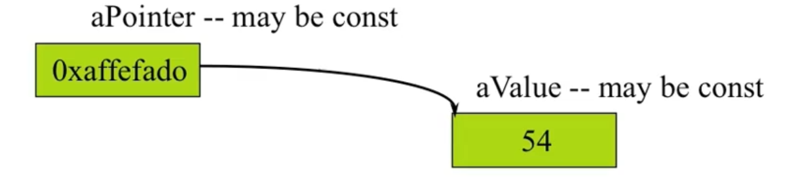
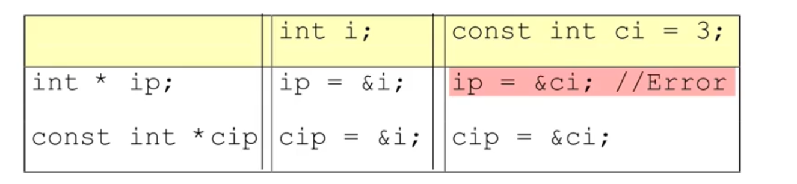

# const

- declares a variable to have a constant value

  ```c
  const int x = 123;
  x = 27; // illegal!
  x++; // illegal!
  
  int y = x; // ok, copy const to non-const
  y = x; // ok, same thing
  
  const int z = y; // ok, const is safer
  ```

# constants

- Constants are variables

  - Observe scoping rules
  - Declared with "const" type modifier

  变量, 对编译器来说变量意味着真的要在内存里面分配地址的说; 常量, 只是说这是编译器在编译过程中记在它自己里面的一个内存表里面的一个东西的说.


# Compile time constants

```c++
const int bufsize = 1024;
```

- value must be initialized
- unless you make an explicit extern declaration;

```c++
extern const int bufsize;
```

- Compiler won't let you change it

**- Complie time constants are entries in compiler symbol table, not really variables.**


# Run-time constants

- const value can be exploited

  ```c++
  const int class_size = 12;
  int arr[class_size];
      
  int x;
  cout << "Please enter the number here: " << endl;
  cin >> x;
  const int size = x;
  double arr[size]; // some compiler this is false, because the value is not defined at the compiling time // ;)
  ```
  


# Pointers and const



```c++
#include <iostream>
using namespace std;

int main()
{
        int a = 10;
        int b = 20;
        cout << a << endl;
        int * const  pa = &a;
        *pa = 30; // OK, *pa can be changed
        pa = &b; // Error, pa cannot be changed, it is read-only
        cout << a << endl;

        return 0;
}
```

```
const.cpp:11:5: error: assignment of read-only variable ‘pa’
  pa = &b;
```


```
#include <iostream>
using namespace std;

int main()
{
        int a = 10;
        int b = 20;
        cout << a << endl;
        const int * pa = &a;
        pa = &b; // OK 
        *pa = 30;// Error!

        cout << a << endl;

        return 0;
}
```

 ```
 error: assignment of read-only location ‘* pa’
   *pa = 30;
 ```


# Pointers and constants

```c++
#include <iostream>
using namespace std;

int main()
{
        int i;
        const int ci = 3;
        int * pi = &i;
        pi = &ci; // ERROR! `invalid conversion from ‘const int*’ to ‘int*’ `
        
        return 0;
}
```



**Remember:**

```c++
*ip = 54; // always legal since ip points to int
*cip = 54; // never legal since cip points to const int
```


# String Literals

```c++
char * s = "Hello, world!"; // 这个就是将地址指向一下
```

- s is a pointer initialized to point to a string constant
- This is actually a **const char * s** but compiler accepts it without the const
- Don't try and change the character values (it is undefined behavior) 


- If you want to change the string, put it in an array:

   ```c++
   char s[] = "Hello, world!"; // 将代码段里的"Hello, world!"拷贝到栈里面来
   ```


```c++
#include <iostream>
using namespace std;

int main()
{
//      const char * s = "hello world!";
//      cout << s << endl;
        char s[] = "hello world"; // use array is okay for changing the string ;)
        cout << s << endl;
        s[0] = 'A';
        cout << s << endl;

        return 0;
}
```


程序起来之后, 内存里面是有好几块不同的地方的, 一般有3种地方

1. 本地变量放在栈里面,

2. new 出来的东西是放在堆里面,

3. 全局变量在全局数据区里面, 而全局变量里的这种常量, e.g. "hello world", 是在代码段里的, 而代码段是不可写的.


你的程序一旦运行起来, 首先就得到一块内存, 尽管这块内存是虚拟的, 但是是独立的. 在计算机硬件部分有一个, MMU, memory management unit, 由它来管理这件事情. MMU 会进行内存保护, 会设定一块区域作为代码段, 是不可写的. 如果试图去写这块区域的话, 会给你一个Bus error或者 Segmentation fault. 实际上是MMU那边的错误, 它会产生一个check的报错. 导致程序中止了, 退出了.


# Conversions

- Can always treat a non-const value as const

  ```c++
  void f(const int * x);
  int a = 15;
  f(&a);
  const int b = a;
  
  f(&b);
  b = a + 1; // Error!
  ```

  

- You cannot treat a constant object as non-constant without an explicit cast (const_cast)


# Passing by const value?

```c++
void f1(const int i)
{
    i++;  // illegal -- compile-time error
}
```

调用传参是不是const不做限制, 只是保证在此处不会做修改


# Returning by const value?

```c++
int f2()
{
        return 2;
}

const int f3()
{
        return 3;
}

int main()
{
        int k;
        const int j = f3(); // const variable must be initialized when it is defined
        k = f2();
        cout << k << endl;
        cout << j << endl;
        k = f3();
        cout << k << endl;

        return 0;
}
```


Tips:

## const修饰变量

const 主要用于把一个对象转换成一个常量，例如：

```
const int size = 512;
size = 0;        // error: assignment of read-only variable
```

上面的例子中，定义size为常量并初始化为512，变量size仍是一个左值，但是现在这个左值是不可修改的，任何修改size的尝试都会导致编译错误。

 

因为常量在定以后就不能被修改，因此const对象定义时必须初始化，否则会引起编译错误，例如：

```
const int size;  // error: uninitialized const
```

> references: https://www.cnblogs.com/chenny7/p/4418926.html


# Passing and returning addresses

- Passing a whole object may cost you a lot. 
- It is better to pass by a pointer. But it is possible for the programmer to take it and modify the original value.
- In fact, whenever you are passing an address into a function, you should make it a **const** if at all possible.


# Constant objects

- What if an object is const?

  ```c++
  const Currency the_raise(42, 38);
  ```

- What members can access the internals?

- How can the object be protected from change?


# Const member functions

- Cannot modify their objects

```c++
int Date::set_day()
{
    // ...error check d here...
    day = d; // ok, non-const so can modify
}

int Date::get_day() const
{
    day ++;      // ERROR modifies data member
    set_day(12); // ERROR calls non-const member
    return day;  // ok
}
```


# Const member function usage

- Repeat the const keyword in the definition as well as the declaration

  ```
  int get_day() const;
  int get_day() const
  {
  	return day;
  }
  ```

- Function members that do not modify data should be declared const

- const member functions are safe for const objects

这个const 意味着this 是const
