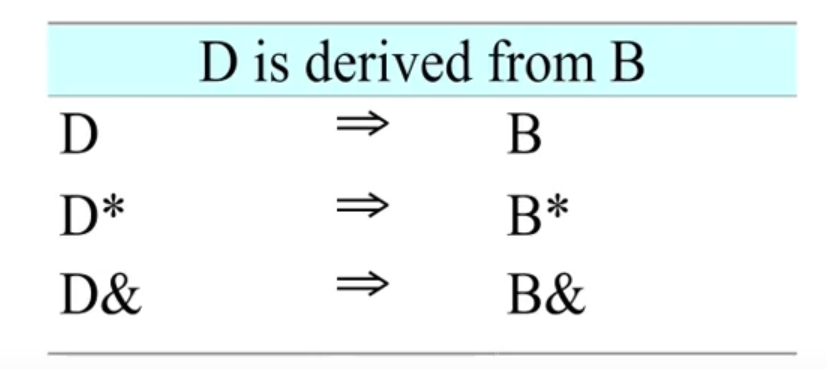
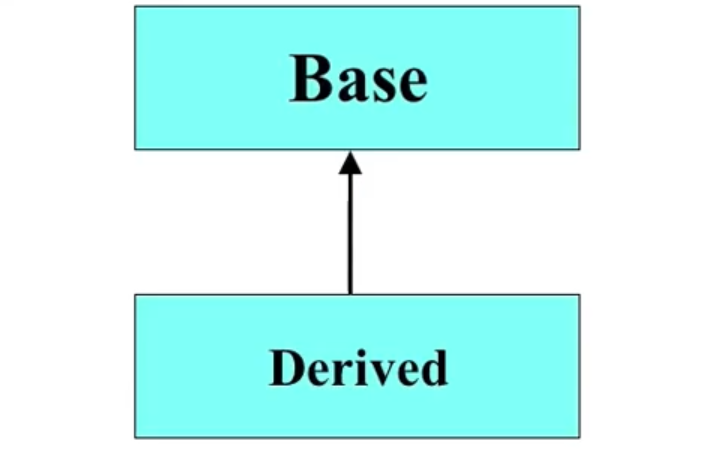

# Conversions

- Public Inheritance should imply substitution
  - If B isa A, you can use a B anywhere an A can be used.
    - if B isa A, then everything that is true for A is also true for B
- Be careful if the substitution is not valid!



如果B是A的子类， 那么B的对象就可以被当作A的对象看待，可以当作A的对象来使用


从内容来看， 一个子类的对象具有一个父类的对象的所有的东西， 就外观来说， 子类继承了父类的public的东西， 所以你对于一个子类来说， 去调用父类的所有的public的函数， 他都能接受。所以, 子类的对象是能够交给父类的.

就像 学生是人的子类, 我们不把它当学生看, 而只是当人看, 这也是可以的.


```c++
#include <iostream>
using namespace std;

class A
{
public:
    int i;
public:
    A():i(10)
    {
        cout << "A()" << endl;
    }

    ~A()
    {
        cout << "~A()" << endl;
    }
};

class B: public A
{
    private:
        int j;
    public:
        B():j(30)  
        {
            cout << "B()" << endl;
        }

        ~B()
        {
            cout << "~B()" << endl;
        }
        void f()
        {
            cout << "j = " << j << endl;
        }
};

int main()
{
    A a;
    B b;

    cout << "a.i: " << a.i << endl;
    cout << "b.i: " << b.i << endl;

    cout << "sizeof(a): " << sizeof(a) << endl;
    cout << "sizeof(b): " << sizeof(b) << endl;

    cout << "&a = " << &a << endl;

    int* p = (int *)&a;
    cout << "p = " << p <<  " *p = " << *p << endl;
    *p = 20;
    cout << "a.i: " << a.i << endl;
    cout << "b.i: " << b.i << endl;

    cout << "&b = " << &b << endl;
    p = (int *)&b;
    cout << "p = " << p <<  " *p = " << *p << endl;
    p++;
    cout << "p = " << p << "; *p = " << *p << endl;
    *p = 50;
    cout << "p = " << p << "; *p = " << *p << endl;
    b.f();


    return 0;
}
```

res:

```c++
A()
A()
B()
a.i: 10
b.i: 10
sizeof(a): 4
sizeof(b): 8 // 可以知道，对象里面保存的是变量， 根据对象的大小就可以知道了的说。
&a = 0x61fe04
p = 0x61fe04 *p = 10
a.i: 20
b.i: 10
&b = 0x61fdfc
p = 0x61fdfc *p = 10
p = 0x61fe00; *p = 30
p = 0x61fe00; *p = 50
j = 50
~B()
~A()
~A()
```


可以知道，对象里面保存的是变量， 根据对象的大小就可以知道了的说。

为什么子类可以当作父类看作？ 因为里面的数据结构一样， 子类虽然有新增加的数据类型， 但是保留了所有父类的结构， 其多出来的部分被无视了。


# Upcasting

- Upcasting is the act of converting from a Derived reference or pointer to a base class reference or pointer.

  

cast 意为 造型， 学生还是学生， 只是看待的眼光发生了变化， 数据没有变化及丢失。

将从子类变成了父类来看待的说


# Upcasting examples

```c++
Manager pete("Pete", "444-55-666", "Bakery");
Employee* ep = &pete; // Upcast
Employee& er = pete; // Upcast
```

Manager is the derived class of Employee ;), so we could view Manager pete as an Employee ;)

```c++
ep.print(); // it is the print function in class Employee
```


