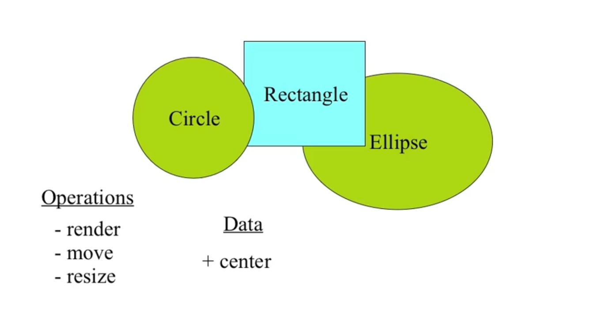
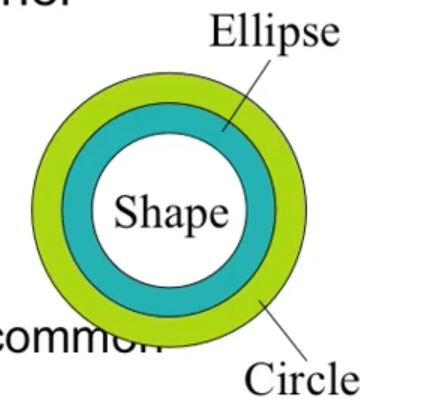
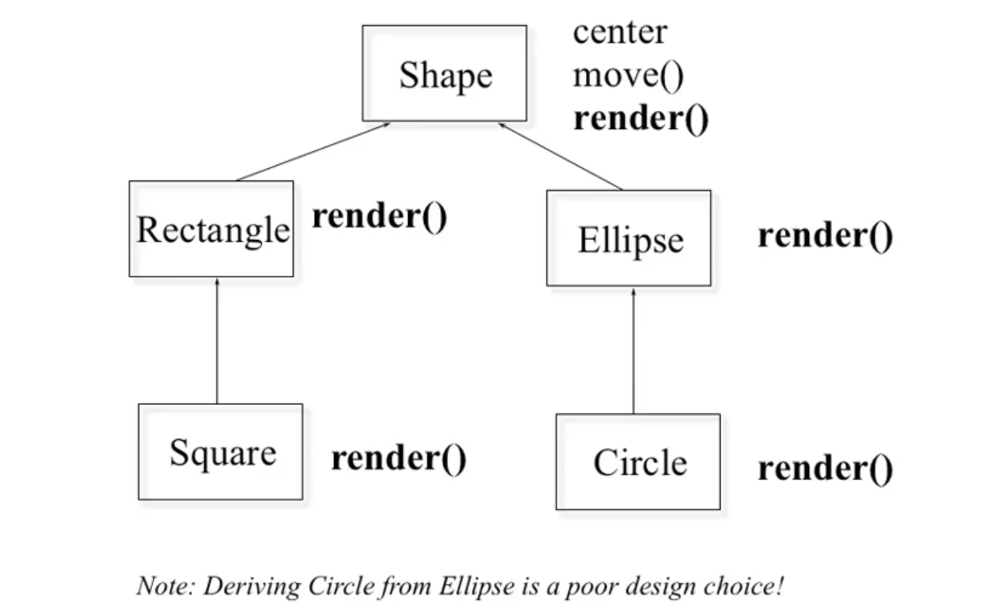
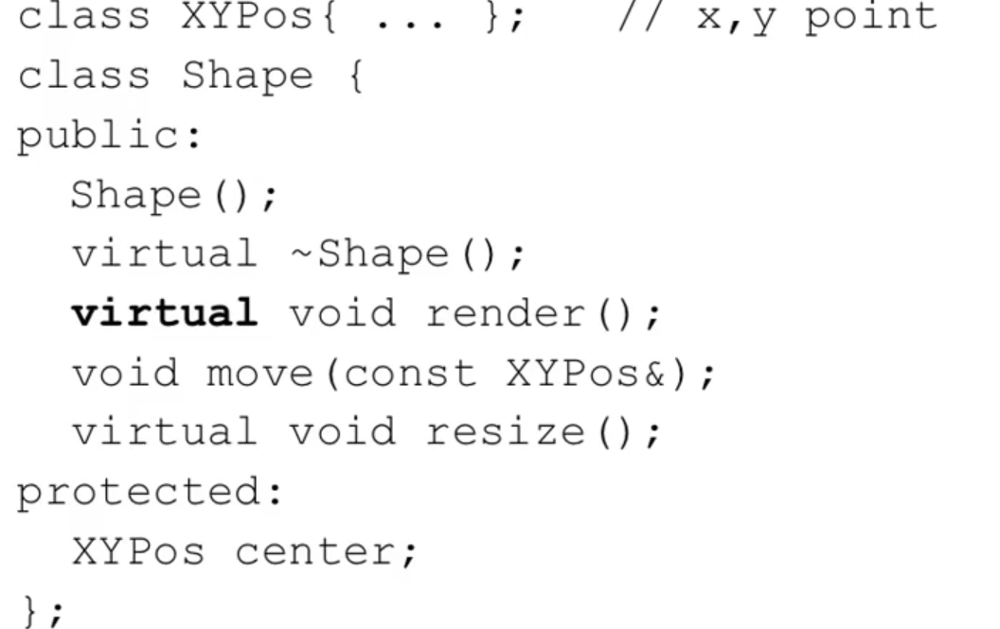
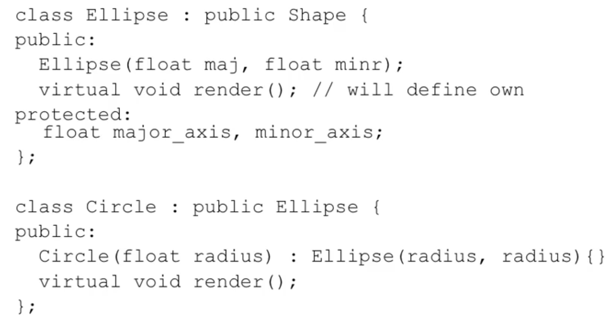
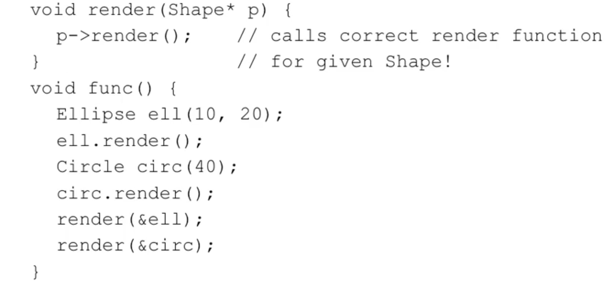

# A drawing program




# Inheritance in C++

- Can define one class in terms of another

- Can capture the notion that

  - An ellipse is a shape
  - A circle is a special kind of ellipse
  - A rectangle is a different shape
  - Circles, ellipses, and rectangles share common
    - attributes
    - services

  - Circles, ellipses, and rectangles are not identical

  


# Conceptual model




# Shape

- Define the general properties of a Shape

  

virtual 的意思是说， 将来Shape类的所有子类里面，如果它重新写了render()函数的话， 名称一样， 参数表也相同，那么这个render()和父类里面的render()就是有联系的，

有了virtual， 子类和父类里面同名的函数才有联系。


析构函数的virtual, 表面上看， 子类和父类的析构函数没有关系的说， 因为子类和父类名称肯定不同，那， 为什么要有virtual, 后面会有解释。


# Add new shapes

 

在Ellipse里面也有render(), 前面也有virtual,不过该virtual关键字, 可加可不加, 只要是继承处的加上了virtual的话, 那么这边就是子子孙孙都是virtual的了, 但是加在这里是个好习惯. 这样的话, 别人就不用看相应的父类是否有virtual关键字了.


# Example



所以， 此处的render()函数是通用函数， 对任何Shape类的子类， 和Shape类自己都是通用的。也就是说， 这个适用于将来新出来的Shape的子类的对象。

`render(&ell)` 和 `render(&circ)`  就是调用的是通用的render()函数， 此处就是向上造型（upcasting）, 即将子类对象ell和circ， 当作Shape对象看待。但是最终是谁改变了呢？ 是Ellipse 和Circle, 因为virtual的意思就在于，对这个函数的调用，如果是通过指针或引用的话， 要等待运行的时候再去判断它的类型。

virtual 的作用就是告诉编译器，对这个函数的调用，如果是通过指针或引用的话， 这个要等待到运行的时候再去判断是什么类型， 如果是Ellipse的对象， 就调用Ellipse的render(), 如果是Circle的对象， 就调用Circle的render().


# Polymorphism

多态性

Example:

```c++
void render(Shape* p)
{
    // 哪个是多态性？ p 是多态性
    // p 指了什么类型的对象， 通过p，就是那个类型的对象的render()函数
    // 即p指的是谁， 它就变成谁的形态， Polymorphism
    p->render(); // calls correct render function for given Shape!1
}

void func()
{
    Ellipse ell(10, 20);
    ell.render();
    Circle circ(40);
    circ.render();
    render(&ell);
    render(&circ);
}
```


多态性（Polymorphism）是建立在两个事情的基础上的：

- Upcast: take an object of the derived class as an object of the base one.

  - Ellipse can be treated as a Shape

- Dynamic binding（动态绑定）:

  - Binding: which function to be called (绑定的意思是说， 当调用一个函数的时候， 到底该调用哪一个函数)

    - Static binding: call the function as the code

      静态绑定， 调用的函数是确定的， 编译的时候就已经确定了

    - Dynamic binding: call the function of the object

      动态绑定， 到运行的时候， 才知道到底该调用哪个函数
      
      也是需要的是指针和引用。
      
      virtual 的作用就是告诉编译器，对这个函数的调用，如果是通过指针或引用的话， 这个要等待到运行的时候再去判断是什么类型， 如果是Ellipse的对象， 就调用Ellipse的render(), 如果是Circle的对象， 就调用Circle的render().

```c++
void render(Shape* p) // 就是说， 你是一个Shape, 你知道自己该怎么render, 那么你就自己render去吧
{
    // 哪个是多态性？ p 是多态性
    // p 指了什么类型的对象， 通过p，就是那个类型的对象的render()函数
    // 即p指的是谁， 它就变成谁的形态， Polymorphism
    p->render(); // calls correct render function for given Shape!1
    // 即是说， p有一个静态类型， 即是Shape*类型， 它还有一个动态类型， 就是会在调用的时候确定  
}
```

如果render()函数是virtual的， 那就意味着这是动态绑定，要等到运行的时候看相应的参数的类型。如果不是virtual的， 发生的就是静态绑定， 即就是Shape*类型。

所以这里不是Shape* p的问题， 而是render()函数的问题， 因为render()函数是virtual的缘故， 这才是动态绑定,


e.g.

```c++
#include <iostream>
using namespace std;

class A
{
public:
	int i,j;
	A():i(10), j(20)
	{
		cout << "A::A()" << endl;
	}

	virtual ~A()
	{
		cout << "A::~A()" << endl;
	}

	virtual void f()
	{
		cout << "A::f()" << endl;
	}

	virtual void g()
	{
		cout << "A::g()" << endl;
	}

	void e()
	{
		cout << "A::e()" << endl;
	}
};


class B: public A
{
public:
	int k;

	B():k(30)
	{
		cout << "B::B()" << endl;
	}
	~B()
	{
		cout << "B::~B()" << endl;
	}
	virtual void f()
	{
		cout << "B::f()" << endl;
	}
	virtual void fk()
	{
		cout << "B::fk()" << endl;
	}
};


class C: public B
{
public:
	int n;
	C():n(40)
	{
		cout << "C::C()" << endl;
	}
	virtual void f()
	{
		cout << "C::f()" << endl;
	}
	virtual void fn()
	{
		cout << "C::fn()" << endl;
	}
};

int main()
{
	// check the deconstructor
	B b;
	C c;
	b = c;
	B* pr = &c;
	cout << "-----first test pr------" << endl;
	pr->f(); // this is dynamic binding
	cout << "------second test obj------" << endl;
	b.f();	//  this is static binding

	return 0;
}
```


A 

B

C
