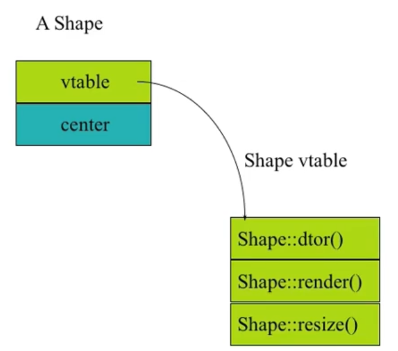
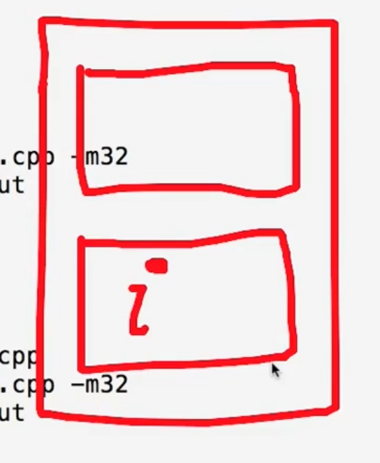
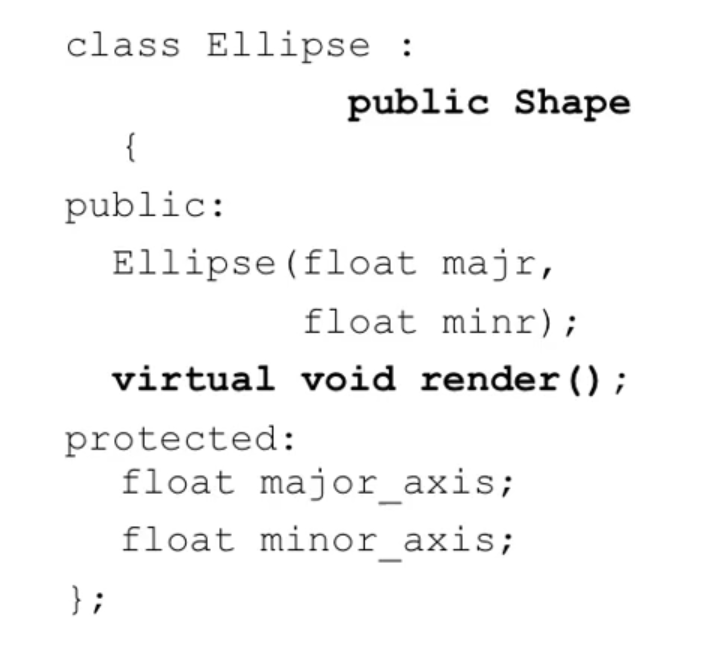
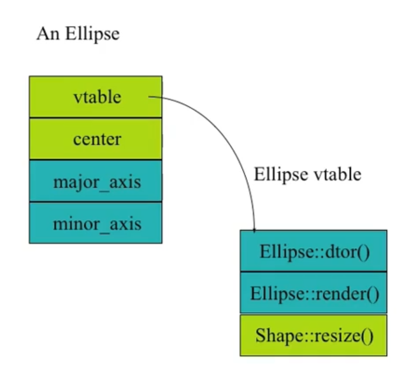
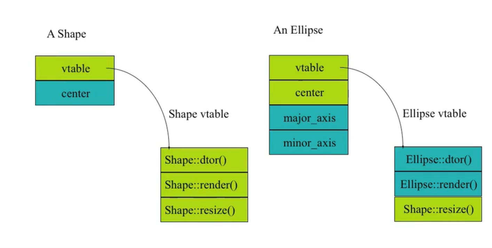
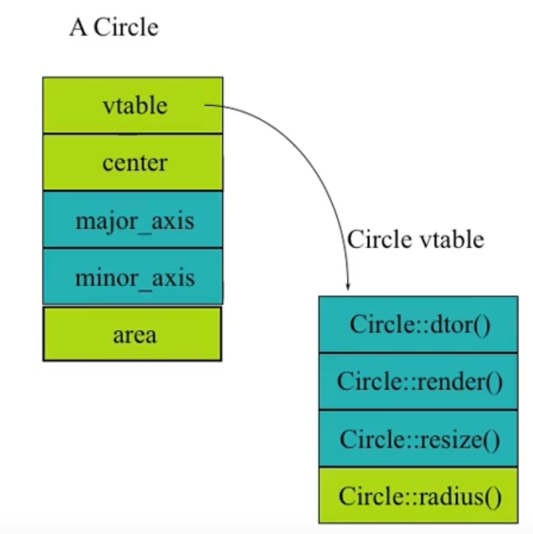
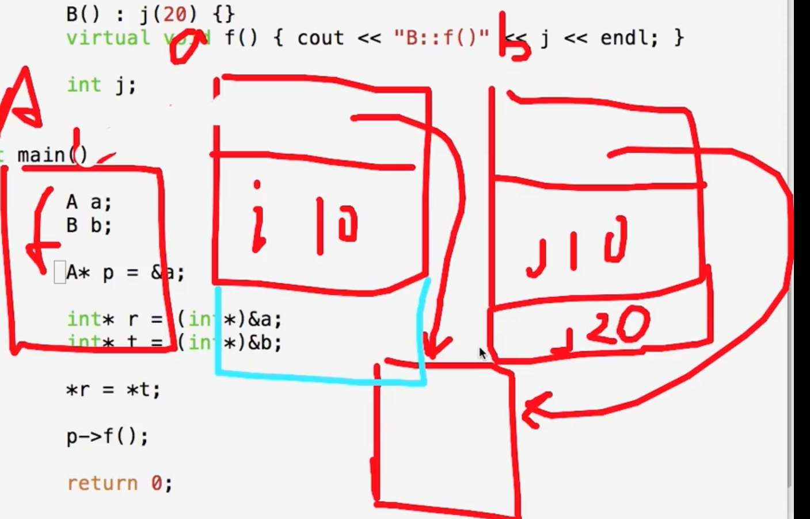

# How virtuals work in C++

```c++
class Shape
{
    public:
    	Shape();
    	virtual ~Shape();
    	virtual void render();
    	void move(const XYPos&);
    	virtual void resize();
    protected:
    	XYPos center;
};
```




任何一个类, 只要有虚函数, 这个类的对象就会比没有虚函数的其他都相同的类所占的空间大一点.

因为所有有virtual的Class里面， 都有一个指针, vfptr.

e.g.

```c++
#include <iostream>
using namespace std;

class A
{
public:
	int i;
	A():i(10)
	{
	}
	~A()
	{
	}
	virtual void f()
	{
		cout << "A::f()" << endl;
	}

	virtual void g()
	{
		cout << "A::g()" << endl;
	}
};

int main()
{
	A a;
	a.f();
	cout << sizeof(a) << endl; // 写一个虚函数的话, sizeof就变成了8, 写两个也是

	int* p = (int*)&a;
	p++;
	cout << *p << endl;
	
	return 0;
}
```



发现结构应该是这样的说， 上面有一个指针vfptr， 下面是保存的变量。


指针vfptr, 指向表vtable， 这个vtable是什么呢？

是它所有的virtual 函数的地址，

这个vtable是谁的？不是对象的， 是类的。

即同一个类的不同对象的vptr的值应该是一样的， 可验证。


```c++
#include <iostream>
using namespace std;

class A
{
public:
	int i,j;
	A():i(10), j(20)
	{
	}
	~A()
	{
	}
	virtual void f()
	{
		cout << "A::f()" << endl;
	}

	virtual void g()
	{
		cout << "A::g()" << endl;
	}

	void e()
	{
		cout << "A::e()" << endl;
	}
};

int main()
{
	A a, b;
	a.f();
	cout << sizeof(a) << endl;

	int* p = (int*)&a; // p here is deferent from p there, but *p is same
	cout << *p << endl;
	p = (int*)&b;
	cout << *p << endl;
	
	return 0;
}
```


# Ellipse





Ellipse是Shape的子类， Ellipse的vtable不是Shape的vtable，在这张vtable中， 很重要的一点是， 它的结构和父类的Shape类是一样的， 如果Ellipse改写了，就用Ellipse的， 如果Ellipse没有的话， 就还是父类的Shape的函数。


动态绑定的实现逻辑， 就是直接通过相应的路径去找到相应的函数。


# Shape vs Ellipse



vtable是实现相应的动态绑定


# Circle

```c++
class Circle:public Ellipse
{
public:
    Circle(float radius);
    virtual void render();
    virtual void resize();
    virtual float radius();
protected:
    float area;
};
```




# What happens if

```c++
Ellipse elly(20F, 40F);
Circle circ(60F);
elly = circ; // what happens there?
```

- not sure how the virtual deconstructor works? how about the constructor? it looks like they are the same.


```c++
#include <iostream>
using namespace std;

class A
{
public:
	int i,j;
	A():i(10), j(20)
	{
		cout << "A::A()" << endl;
	}

	virtual ~A()
	{
		cout << "A::~A()" << endl;
	}

	virtual void f()
	{
		cout << "A::f()" << endl;
	}

	virtual void g()
	{
		cout << "A::g()" << endl;
	}

	void e()
	{
		cout << "A::e()" << endl;
	}
};


class B: public A
{
public:
	int k;

	B():k(30)
	{
		cout << "B::B()" << endl;
	}
	~B()
	{
		cout << "B::~B()" << endl;
	}
	virtual void f()
	{
		cout << "B::f()" << endl;
	}
	virtual void fk()
	{
		cout << "B::fk()" << endl;
	}
};


class C: public B
{
public:
	int n;
	C():n(40)
	{
		cout << "C::C()" << endl;
	}
	virtual void f()
	{
		cout << "C::f()" << endl;
	}
	virtual void fn()
	{
		cout << "C::fn()" << endl;
	}
};

int main()
{
	// check the deconstructor
	B b;
	C c;
	b = c;
	B* pr = &c;
	cout << "-----first test pr------" << endl;
	pr->f(); // this is dynamic binding
	cout << "------second test obj------" << endl;
	b.f();	//  this is static binding
	cout << "------third test pr of the obj------" << endl;
	pr = &b;
	pr->f(); // 仍然是B的相应的函数， 静态绑定， 也就是说b没有变化

	return 0;
}
```

res: 

```c++
A::A()
B::B()
A::A()
B::B()
C::C()
-----first test pr------
C::f()
------second test obj------
B::f()
------third test pr of the obj------
B::f()
B::~B()
A::~A()
B::~B()
A::~A()
```




如果你想更改一下类的地址了呗...

```c++
#include <iostream>
using namespace std;

class A
{
private:
	int i;
public:
	A():i(10)
	{

	}

	virtual ~A()
	{

	}

	virtual void f()
	{
		cout << "A::f(), i = "<< i << endl;
	}
};

class B:public A
{
private:
	int j;
public:
	B():j(20)
	{

	}
	virtual void f()
	{
		cout << "B::f(), j = " << j << endl;
	}
};

int main()
{
	A a;
	B b;
	
	A* p = &a;
	int* r = (int*)&a;
	int* s = (int*)&b;
	*r = *s; // 就是这样的说...

	p->f();

	return 0;
}
```


观察所有的vptr

```c++
#include <iostream>
using namespace std;

class A
{
private:
	int i;
public:
	A():i(10)
	{

	}

	virtual ~A()
	{

	}

	virtual void f()
	{
		cout << "A::f(), i = "<< i << endl;
	}
};

class B:public A
{
private:
	int j;
public:
	B():j(20)
	{

	}
	virtual void f()
	{
		cout << "B::f(), j = " << j << endl;
	}
};

int main()
{
	A a, a1;
	B b, b1;
	
	A* p = &a;
	int* r = (int*)&a;
	int* s = (int*)&b;
	*r = *s;
	int* z = (int *)(*s);
	cout << z << endl;


	return 0;
}
```


```c#include <iostream>
using namespace std;

class A
{
private:
	int i;
public:
	A():i(10)
	{

	}

	virtual ~A()
	{

	}

	virtual void f()
	{
		cout << "A::f(), i = "<< i << endl;
	}
};

class B:public A
{
private:
	int j;
public:
	B():j(20)
	{

	}
	virtual void f()
	{
		cout << "B::f(), j = " << j << endl;
	}
};

int main()
{
	A a, a1;
	B b, b1;
	
	A* p = &a;
	int* r = (int*)&a;
	int* s = (int*)&b;
	*r = *s;
	int* z = (int *)(*s);
	cout << z << endl;


	return 0;
}
```


```c++
#include <iostream>
using namespace std;

class A
{
private:
	int i;
public:
	A():i(10)
	{

	}

	virtual ~A()
	{

	}

	virtual void f()
	{
		cout << "A::f(), i = "<< i << endl;
	}
};

class B:public A
{
private:
	int j;
public:
	B():j(20)
	{

	}
	virtual void f()
	{
		cout << "B::f(), j = " << j << endl;
	}
};

int main()
{
	A a;
	B b;
	A* p = &b;
	p->f();

	a = b; // b赋值给a的时候, vptr并没有赋值过去
	a.f();

	p = &a;
	p->f();

	int* r = (int*)&a;
	int* s = (int*)&b;
	*r = *s;
	a.f();
	p->f();

	return 0;
}
```

- a = b; // b赋值给a的时候, vptr并没有赋值过去, 所以就还是p->f(); 仍调用的是a的函数

  ```
  a = b;
  p = &a;
  p->f();
  ```


- Area of circ is sliced off

  - (Only the part of circ that fits in elly gets copied)

- Vtable from circ is ignored; the vtable in elly is the Ellipse vtable

  ```
  elly.render(); // Ellipse::render()
  ```


# What happens with pointers?

```c++
Ellipse* elly = new Ellipse(20F, 40F);
Circle* circ  = new Circle(60F);
elly = circ;
```

- Well, the original Ellipse for elly is lost...

- elly and circ point to the same Circle object!

  ```
  elly->render(); // Circle::render()
  ```


# Virtuals and reference arguments

```c++
void func(Ellipse& elly)
{
    elly.render();
}

Ellipse elly;
Circle circ(60F);
elly.func(circ); // Circle's render() will be called! 
					// references are the same as the pointers
```

- References act like pointers
- Circle::render() is called


# Virtual destructors

- Make destructors ***virtual*** if they might be inherited

  ```
  Shape *p = new Ellipse(100.0F, 200.0F);
  ...
  delete p;
  ```

- Want **Ellipse::~Ellipse()** to be called

  - **Must declare** Shape::~Shape() **virtual**
  - It will call Shape::~Shape() automatically

- If Shape::~Shape() is **not virtual**, only Shape::~Shape() will be invoked! 

  如果Shape::~Shape不是virtual的话， 这里发生的就是静态绑定， 析构的时候， 就只会调用Shape::~Shape(), 子类的析构就会被丢掉了。

  如果是virtual的话， 发生的就是动态绑定， 就会通过vptr来找到相应的析构函数， 即找到对象自己的析构函数， 

  所以， 你的类里面有一个virtual函数， 它的析构函数就必须是virtual的, 否则可能有麻烦。

  因而， 所有的其他的OOP语言默认都是virtual的， 只有C++默认的不是virtual的， 即默认的是静态绑定， 只有加上virtual才变成了动态绑定。

  C++为什么这样做呢？ 因为考虑到效率， 当然是静态绑定最快了， 是编译时刻就固定了， 当然是比较快了。

  e.g.

  ```c++
  #include <iostream>
  using namespace std;
  
  class A
  {
  private:
  	int i;
  
  public:
  	A(int a):i(a)
  	{
  
  	}
  
  	A():i(10)
  	{
  
  	}
  
  	virtual ~A()
  	{
  		cout << "A::~A()" << endl;
  	}
  	
  	virtual void f()
  	{
  		cout << "A::f()" << endl;
  	}
  
  	void g(A& al)
  	{
  		al.f();
  	}
  };
  
  
  class B:public A
  {
  private:
  	int j;
  public:
  	B(int b):j(b)
  	{
  
  	}
  	B():j(20)
  	{
  
  	}
  
  	virtual ~B()
  	{
  		cout << "B::~B()" << endl;
  	}
  
  	virtual void f()
  	{
  		cout << "B::f()" << endl;
  	}
  };
  
  int main()
  {
  	A* p = new B;
  	delete p;
  
  	return 0;
  }
  ```

  

# Overriding

- Overriding redefines the body of a virtual function

  ```c++
  class Base
  {
      public:
      	virtual void func();
  };
  
  class Derived: public Base
  {
      public:
      	virtual void func();
      	// overrides Base::func()
  };
  ```

  Override, 子类和父类的话， 名称相同， 参数列表也相同， 这个就是Override (覆盖或者说是改写)


# Calls up the chain

- You can still call the overridden function:

  ```c++
  void Derived::func()
  {
      cout << "In Derived::func!" << endl;
      Base::func(); // call to base class
  }
  ```

- This is a common way to add new functionality

- No need to copy the old stuff!

  如果在子类的重写的函数里面想要调用父类的函数的话， 就只需要， 在函数名前面写上父类名加上::


# Return types relaxation (current)

- Suppose D is publicly derived from B
- D::f() can return a subclass of the return type defined in B::f()
- Applies to pointer and reference types
  - e.g. D&, D*
- In most compilers now


# Relaxation example

```c++
class Expr
{
    public:
    	virtual Expr* newExpr();
    	virtual Expr& clone();
    	virtual Expr  self();
};

class BinaryExpr: public Expr
{
    public:
    	virtual BinaryExpr* newExpr(); // OK
    	virtual BinaryExpr& clone(); // OK
    	virtual BinaryExpr	self(); // Error!
};
```


# Overloading and virtuals

- Overloading adds multiple signatures

  ```c++
  class Base
  {
      public:
      	virtual void func();
      	virtual void func(int);
  };
  ```

  

- If you override an overloaded function, you must override all of the variants!
  - Cannot override just one
  - If you do not override all, some will be hidden

如果你需要改写重载的函数， 那么你必须override所有的！
