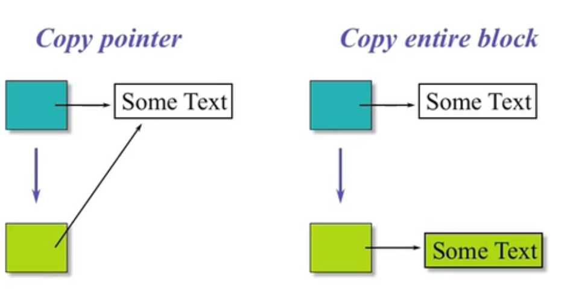
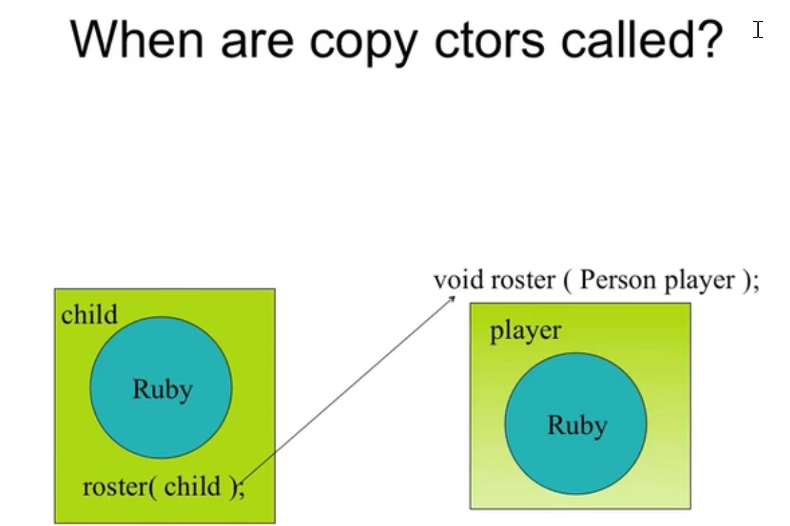
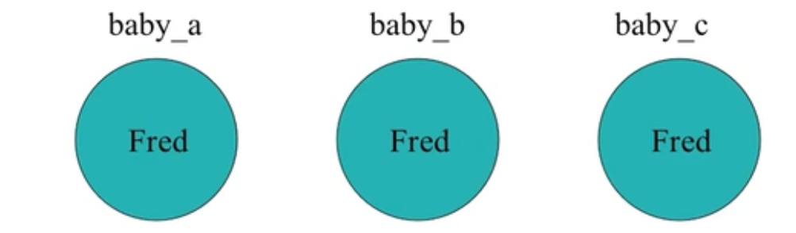
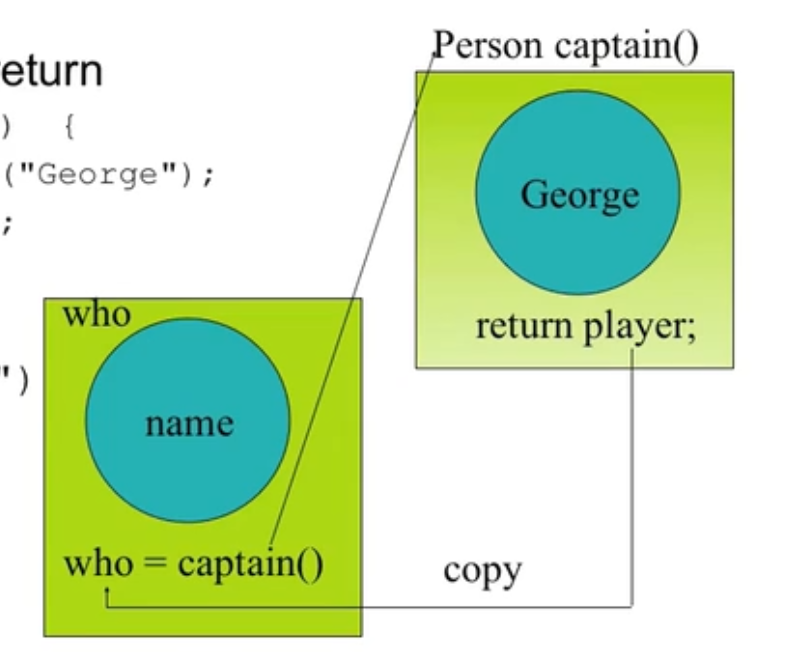

# What if class contains pointers?

```c++
class Person
{
public:
    Person(const char * s);
    ~Person();
    void print();
private:
    char * name;   
};
```


# Choices




e.g.

Person.h

```c++
#ifndef __PERSON_H__
#define __PERSON_H__

class Person
{
public:
	Person(const char * s);
	~Person();
	//void print();
//private:
	char* name;
};

#endif
```

Person.cpp

```c++
#include "Person.h"
#include <cstring>
#pragma warning(disable : 4996)
using namespace std;

Person::Person(const char * s)
{
	name = new char[strlen(s) + 1];
	strcpy(name, s);
}

Person::~Person()
{
	delete[] name;
}
```

main.cpp

```c++
#include <iostream>
#include <string>
#include "Person.h"
using namespace std;


int main()
{
	Person p1("John");

	Person p2(p1); // 这样会析构两遍, 所以这样的代码的安排可能是有问题的

	printf("p1.name = %p\n", p1.name);
	printf("p2.name = %p\n", p2.name);

	return 0;
}
```


最终报错, 因为p2, p1都指向了同一块地方, 析构了两遍. 就会出现malloc的错误

这样会析构两遍, 所以这样的代码的安排可能是有问题的,如果加上了拷贝构造函数就可以解决该问题, 拷贝构造函数重新new一个内存就好了

# Character strings

- In C++, a character string is
  - An array of characters
  - With a special terminator - '\0' or ASCII null
- The string "C++" is represented, in memory, by an array of four(4, count'em) characters

​	c++'\0'


# Standard C library String functions

- Declared in <cstring>

  `size_t strlen(const char* s);`

  - s is a null-terminated string
  - returns the length of s
  - length does not include the terminator!

  size_t 通常而言是int, 但是int是随平台变化的, size_t是不随平台变化的.

  ` char * strcpy(char * dest, const char * src);`

  - Copies src to desc stopping after the terminating null-character is copied. (src should be null-terminated!)
  - dest should have enough memory space allocated to contain src string.
  - Return Value: returns dest


# Person (char*) implementation

```c++
#include "Person.h"
#include <cstring> // #include <string.h>
#pragma warning(disable : 4996)
using namespace std;

Person::Person(const char * s)
{
	name = new char[::strlen(s) + 1];
	::strcpy(name, s);
}

Person::~Person()
{
	delete[] name;
}
```


# Person copy constructor

- To Person declaration add copy constructor prototype:

  `Person(const Person& w); // copy constructor `

- To Person.cpp add copy constructor definition:

  ```c++
  Person::Person(const Person& w)
  {
      name = new char[::strlen(w.name) + 1];
      ::strcpy(n);
  }
  ```

- No value returned

- Accesses w.name across client boundary

- The copy constructor initializes uninitialized memory


# When are copy constructors called?




调用拷贝构造的地方:

1. 调用的构造函数, 写的是对象本身, 而不是别的.
2. 总的来说, 拷贝构造发生的时候就是初始化的时候, 但是拷贝构造的话, 有些其他的场景,比如调用函数

```c++
void roster(Person ); // declare function
Person child("Ruby"); // create object
roster(child); 		  // call function, there should be a copy construction ;)
```


- During initialization

  ```c++
  Person baby_a("Fred");
  
  // these use the copy constructor
  Person baby_b = baby_a;  // initialization, not an assignment
  Person baby_c(baby_a);   // initialization, not an assignment
  ```

  

- During function return

  ```c++
  Person captain()
  {
      Person player("George");
      return player;
  }
  ...
  Person who("");
  ...
  ```

  




# Copies and overhead

- Compilers can "optimize out" copies when safe!
- Programmers need to
  - Program for "dumb" compilers
  - Be ready to look for optimizations


# Example

```c++
Person copy_func(char * who)
{
    Person local(who);
    local.print();
    return local;  // copy ctor called
}

Person nocopy_func(char * who)
{
    return Person(who);
} // no copy needed
```


# Constructions vs. assignment

- Every object is constructed once
- Every object should be destroyed once
  - Failure to invoke delete()
  - Invoking delete() more than once
- Once an object is constructed, it can be the target of many assignment operations


# Person: string name

- What if the name was a string (and not a char*)?

  ```c++
  #include <string> // 使用C++z自己的string 类型, 就无须再写一个拷贝构造函数, 因为这种复制是member-wise的
  // 会再进行拷贝
  
  class Person
  {
  public:
  	Person(const string& s);
  	~Person();
  	//void print();
  //private:
  	char* name;
  };
  ```


# Copy ctor guidelines

- In general, be explicit

  -- Create your own copy ctor -- do not rely on the default

- If you do not need one declare a private constructor (这种可能也不错的说)

  - prevents creation of a default copy constructor
  - generates a compiler error if try to pass-by-value
  - don't need a definition

就是说写一个类, 就给它一个拷贝构造, 为了明确起见. 需要这三个函数, 默认构造函数, 虚的析构函数, 拷贝构造函数

default ctor ; virtual dtor; copy ctor