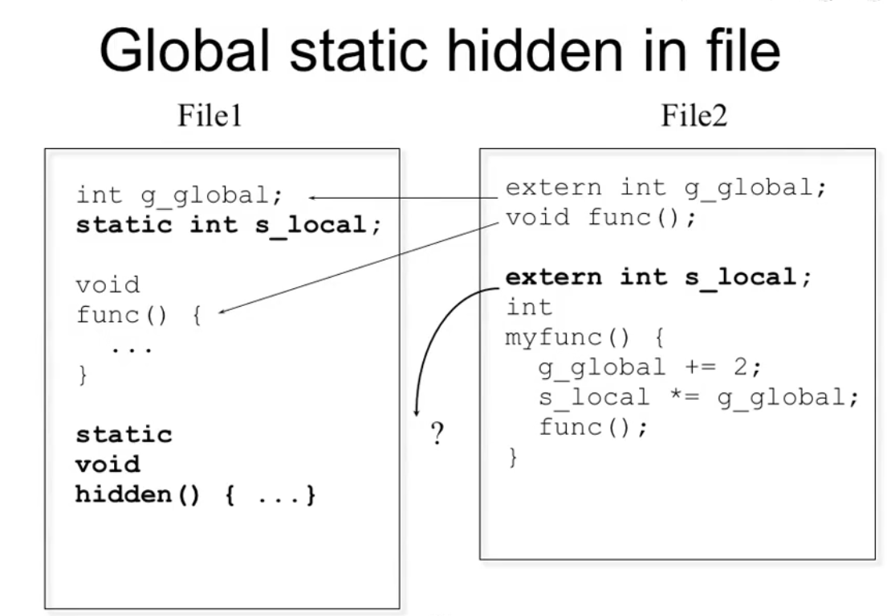

# Static in C++

- Two basic meanings

  - Static storage
    - allocated once at a fixed address
  - Visibility of a name
    - internal linkage
  - Don't use static except inside functions and classes.

  

  # Uses of "static" in C++

  | Usages                  | Characteristics                                              |
  | ----------------------- | ------------------------------------------------------------ |
  | Static free functions   | ~~Internal linkage~~ (deprecated)                            |
  | Static global variables | ~~Internal linkage~~ (deprecated)                            |
  | Static local variables  | Persistent storage                                           |
  | Static member variables | Shared by all instances                                      |
  | Static member function  | Shared by all instances, can only access static member variables |
  


### Static in C

#### Global static hidden in file




# Static inside functions

- Value is remembered for entire program
- Initialization occurs only once

Static 的本地变量就是全局变量, 但是它有特殊的访问属性, 只能在那个函数内被访问

- Example:

  - count the number of times the function has been called

    ```c++
    void f()
    {
        static int num_calls = 0;
        num_calls++;
    }
    ```


# Static applied to objects

- Suppose you have a class

  ```c++
  class X
  {
    X(int, int);  
    ~X();
  };
  ```

- And a function with a static X object

  ```c
  void f()
  {
      static X my_X(10, 20);
  }
  ```

  - 它在哪里 (全局数据区, 在link的时候就分配好了)

  - 它什么时候被构造出来

# Static applied to objects...

- Construction occurs when definition is encountered
  - Constructor called at-most once
  - The constructor arguments must be satisfied
- Destruction takes place on exit from program
  - Compiler assures LIFO order of destructors (Last In, First Out, First In, Last Out)


# Conditional construction
有条件的构造
- Example: conditional construction

  ```c++
  void f(int x)
  {
      if(x > 10)
      {
          static X my_X(x, x * 21);
      }
  }
  ```

  - my_X
    - is constructed once, if f() is ever called with x > 10
    - retains its value
    - destroyed only if constructed


# Global objects

- Consider

  ```c
  #include "X.h"
  X global_x(12, 34);
  X global_x2(8, 16);
  ```

- Constructors are called before main() is entered

  - Order controlled by appearance in file
  - In this case, `global_x` before `global_x2`
  - main() is no longer the *first* function called

- Destructors called when

  - main() exits
  - exit() is called


main()函数本来就是一个函数， 真正main()的话， 已经是很多句话之后了


# Static Initialization Dependency

- Order of construction within a file is known
- Order of between files is unspecified!
- Problem when non-local static objects in different files have dependencies.
- A non-local static object is:
  - defined at global or namespace scope
  - declared static in a class
  - defined static at file scope

​    


