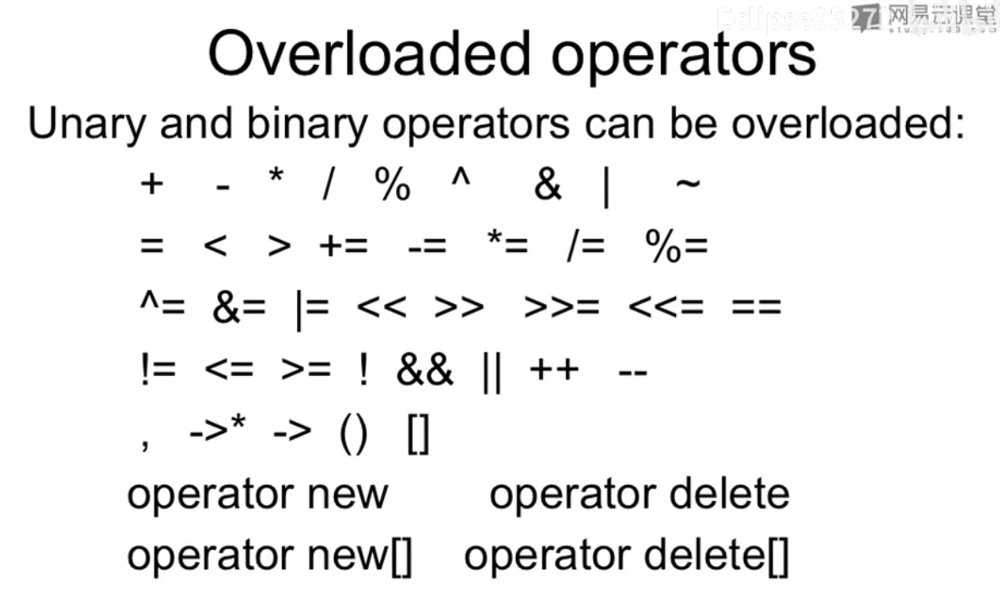
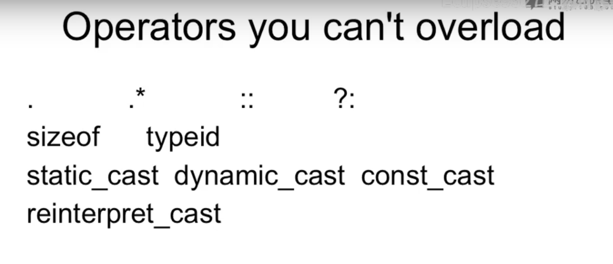

# Overloaded operators

- Allows user-defined types to act like built-in types
- Another way to make a function call

在C++里面, 运算符可以重载, 所谓重载, 就是写函数改变这些运算符的行为.





# Restrictions

- Only existing operators can be overloaded (you can't create a ** operator for exponentiation)

- Operators must be overloaded on a class or enumeration type
- Overloaded operators must
  - Preserve number of operands 保留原有的需要的操作数数量
  - Preserve precedence  保留原有的优先级


# C++ overloaded operator

- Just a function with an operator name!

  - Use the operator keyword as a prefix to name 

    e.g. operator * (...)

- Can be a member function

  - Implicit first argument 有隐藏的参数this

    e.g.

    `const String String::operator + (const String& that);` 

    //+号的话, 需要两个参数, 已经有一个隐藏的参数了, 只需要再定义另一个参数就可以了的说

- Can be a global (free) function

  - Both arguments explicit 就没有隐藏的参数了, 两个参数都是直接的显示的

    e.g.

    `const String operator+ (const String& r, const String & l);  `


# How to overload

- As member function
  - Implicit first argument
  - No type conversion performed on receiver
  - Must have access to class definition


# Operators as member functions

```c++
class Integer
{
    public:
    	Integer(int n = 0):i(n)
        {
            
        }
    
    	const Integer operator+(const Integer& n) const
        {
            return Integer(i + n.i);
        }
    private:
    	int i;
};
```


# Member Functions

```c++
Integer x(1), y(5), z;
x + y;			// =========> x.operator+(y); 
```

运算符左边的那个叫做receiver, 它在整个事件中起到一个作用, 决定我们用哪一个+, 选择对应的operator的函数.

- Implicit first argument
- Developer must have access to class definition
- Members have full access to all data in class
- No type conversion performed on receiver

```c++
z = x + y; // OK, can use the overloaded operators
z = x + 3; // OK, can use the overloaded operators
z = 3 + y; // ERROR! Cannot use the overloaded operators
```


- For binary operators (+, -, *, etc) member functions require one argument.

- For unary operators (unary -, !, etc) member functions require no arguments:

  e.g. 取负号的作用的说

  ```c++
  const Integer operator- () const 
  {
      return Integer(-i); // 不更改i本身, 制造一个新的数返回回去
  }
  
  z = -x;		// z.operator = (x.operator- ());
  ```


# How to overload 

- As a global function
  - Explicit first argument
  - Type conversions performed on both arguments
  - Can be made a friend


# Operator as a global function

```c++
const Integer operator+(const Integer& rhs, const Integer& lhs);
Integer x, y;
x + y  =======> operator+(x, y);
```

- Explicit first argument
- Developer does not need special access to classes
- May need to be a friend
- Type conversions performed on both arguments


# Global operators (friend)

```c++
class Integer
{
    friend const Integer operator+(const Integer& lhs, const Integer& rhs);
};

const Integer operator+(const Integer& lhs, const Integer& rhs)
{
    return Integer(lhs.i, rhs.i);
}
// 通过友元的方式来访问类内部的变量
```


# Global operators

- binary operators require two arguments

- unary operators require one argument

- conversion:

  ```c++
  z = x + y; // OK
  z = x + 3; // OK
  z = 3 + y; // OK
  z = 3 + 7; // OK
  ```

- If you don't have access to private data members, then the global function must use the public interface (e.g. accessors)


# Tips: Members vs. Free Functions

- Unary operators should be members
- = () [] -> ->* must be members
- assignment operators should be members
- All other binary operators as non-members

换句话说, 我们推荐做成非成员的函数
