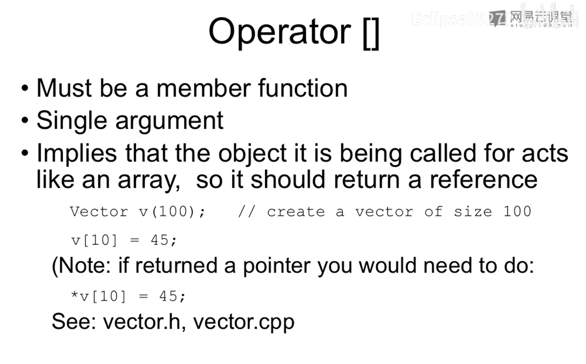

# Argument Passing

- if it is read-only pass it in as a const reference (except built-ins)

- make member functions const that don't change the class (boolean operators, +,-, etc)

- for global functions, if the left-hand side changes pass as a reference (assignment operators)


# Return Values

- Select the return type depending on the expected meaning of the operator.

  For example, 

  - For operator+ you need to generate a new object. Return as a const object so the result cannot be modified as an lvalue.
  - Logical operators should return bool (or int for older compilers).


# The prototypes of operators

- +-*/%^&|~

```c++
const T operatorX(const T& l, const T& r) const;
```

- ! && || < <= == >= >

```c++
bool operatorX(const T& l, const T& r) const; 
```

- []

```c++
T& T::operator[](int index);
```


前++:

this 是一个指针, 加一个*之后, 是对象, 然后这个对象的引用被返回出去.

后++:

`++(*this)` 这里用第一个前++的函数来定义第二个函数




[] 这个运算符一般就是在那个相应的东西是表示容器的时候才会进行的说, 如果不是表示容器的话, 就不需要进行相应的东西的说了, 
