# Why templates?

- Suppose you need  a list of X and a list of Y
  - The list would use similar code
  - They differ by the type stored in the list
- Choices
  - Require common base class
    - May not be desirable
  - Clone code
    - preserve type-safety
    - hard to manage
  - Untyped lists
    - type unsafe


# Template

- Reuse source code
  - generic programming
  - use types as parameters in class or function definitions
- Template functions
  - Example: sort function
- Template classes
  - Example: containers such as stack, list, queue, ...
    - Stack operations are independent of the type of items in the stack
  - template member function


# Example: swap function template

```c++
template < class T >
void swap(T& x, T& y)
{
    T temp = x;
    x = y;
    y = temp;
}
```

- The **template** keyword introduces the template
- The **class T** specifies a parameterized type name
  - class means any built-in type or user-defined type
- Inside the template, use T as a type name

**template** 下面的就是模板, 如果是类就是类的模板, 是函数就是函数的模板

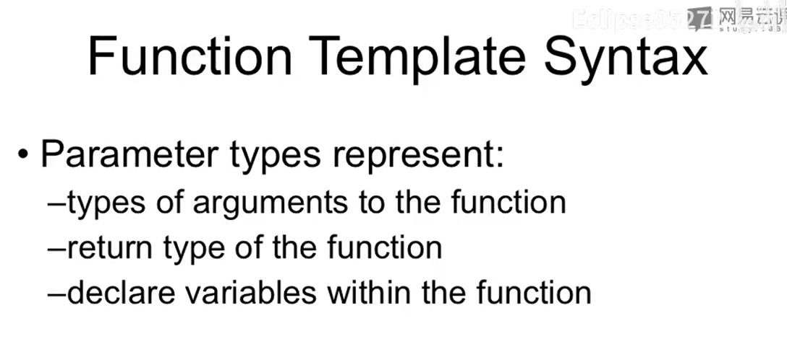

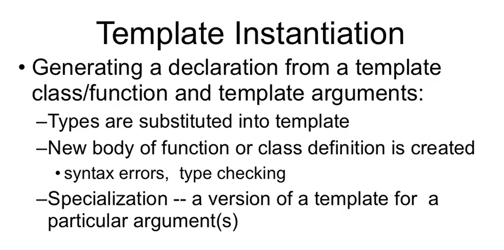

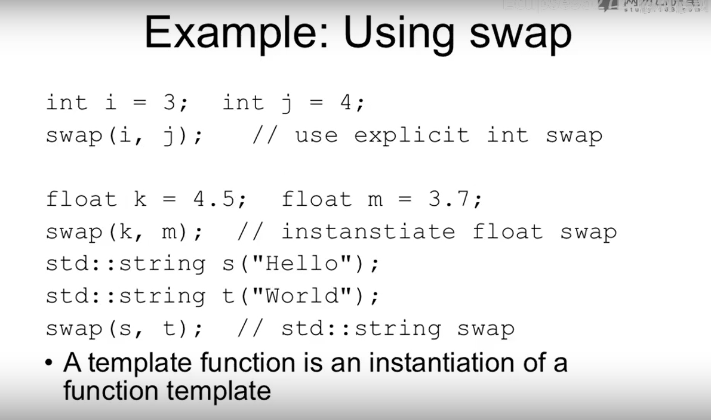

A template is a declaration but not a definition.

当C++编译器遇到那些template的代码的时候, 它其实什么也不干, 只是把它们给记下来.

模板的作用是告诉编译器, 你要怎样帮我做出那样的函数来.


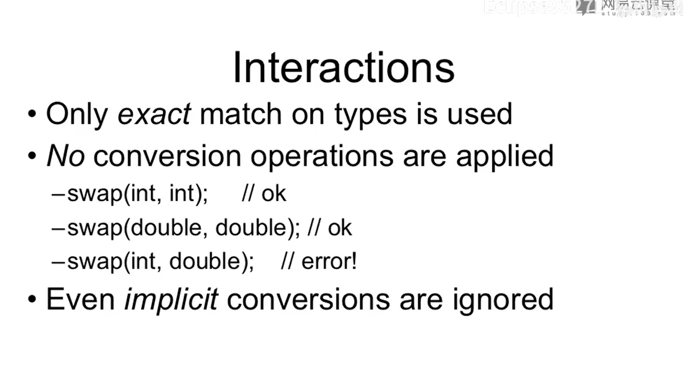

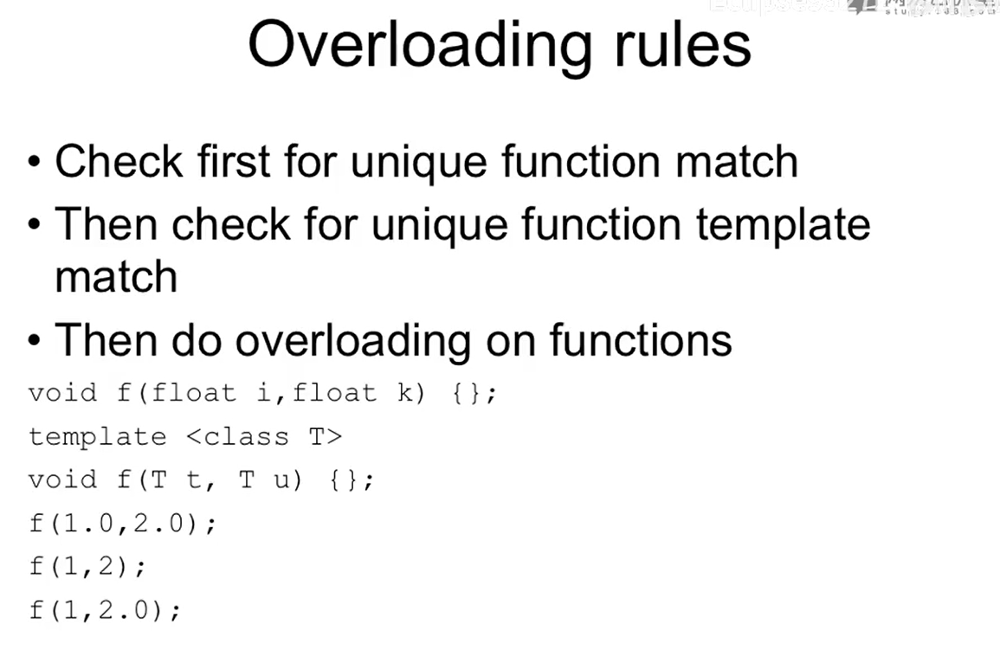

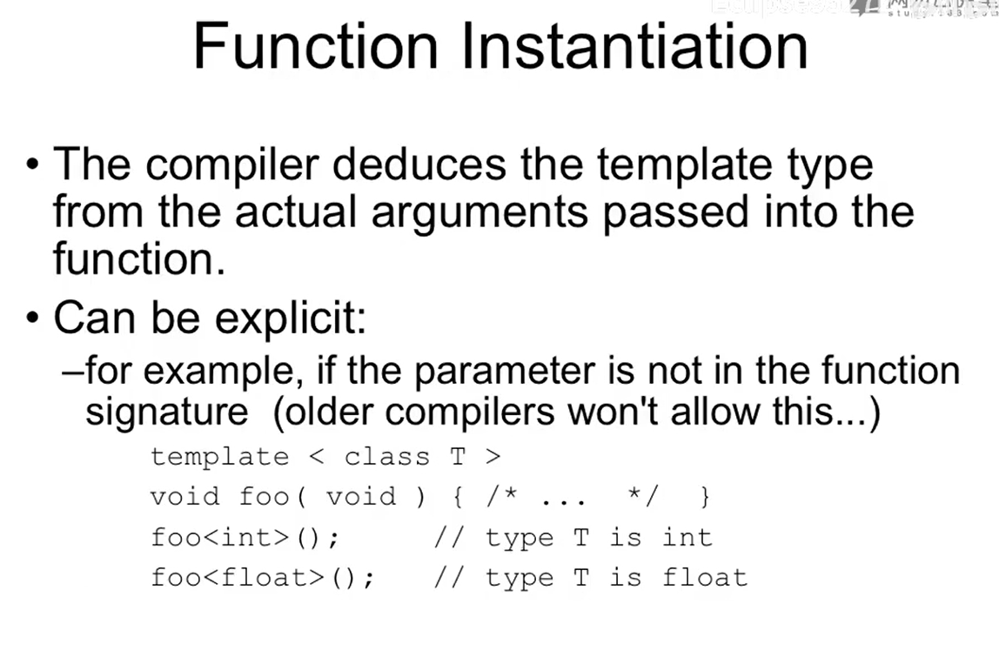

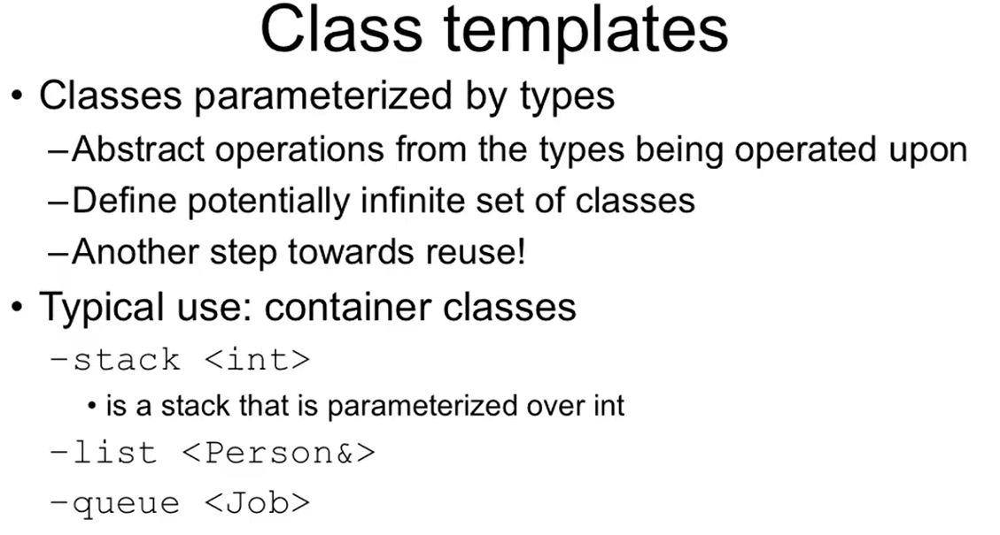

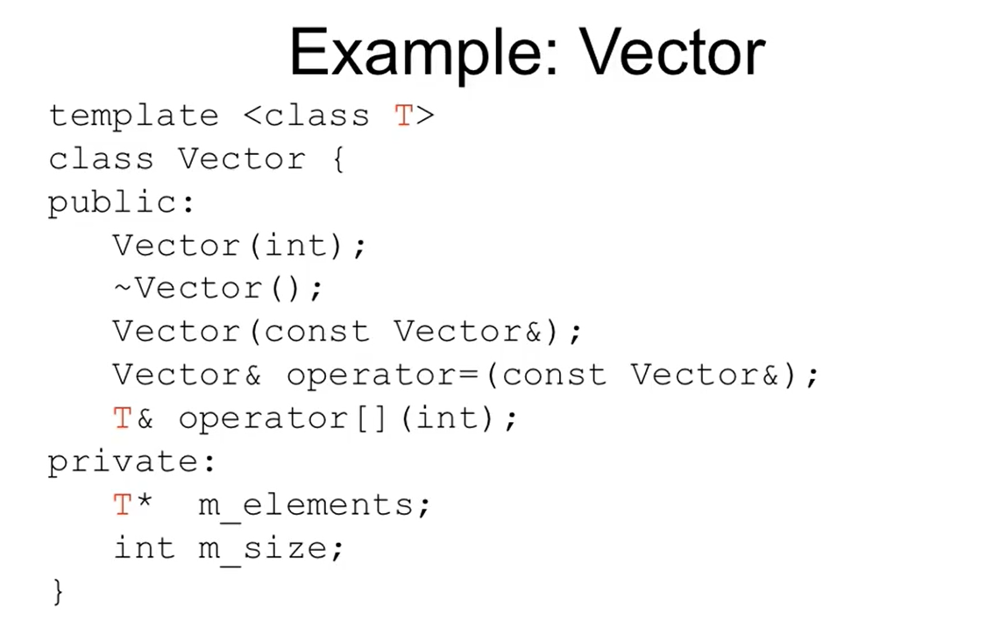

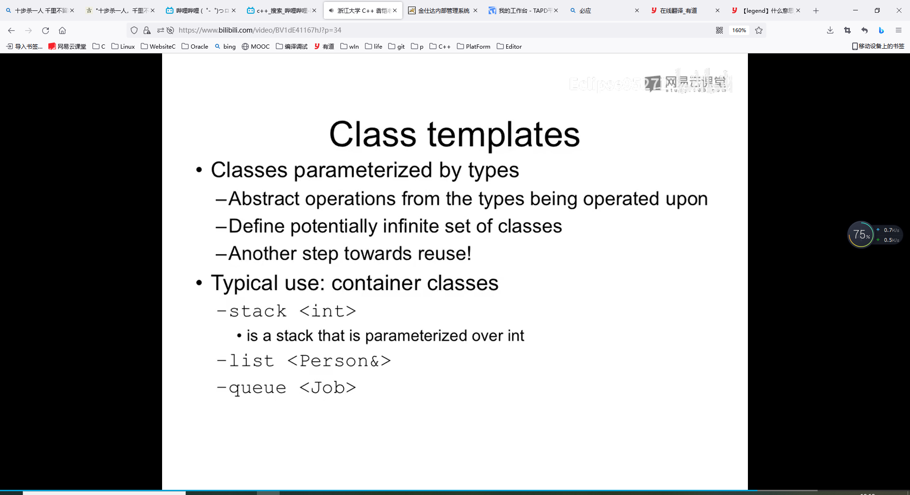


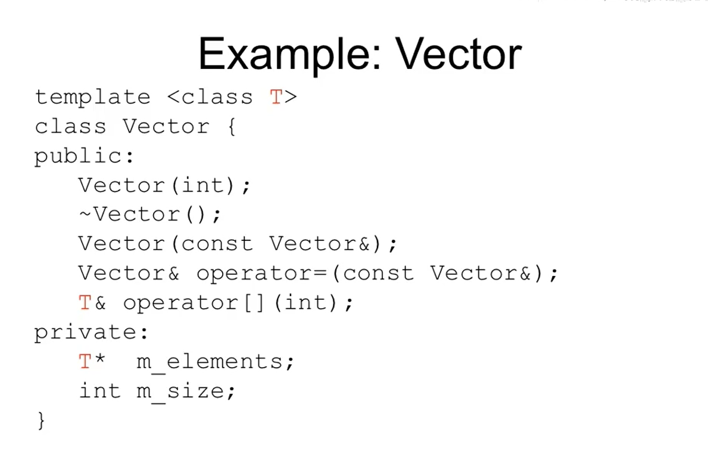
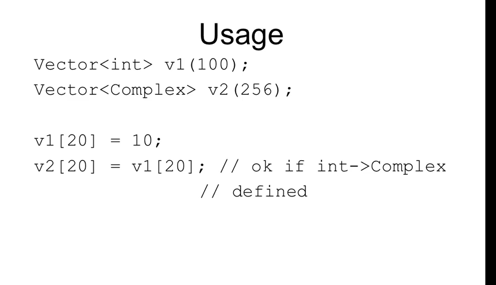

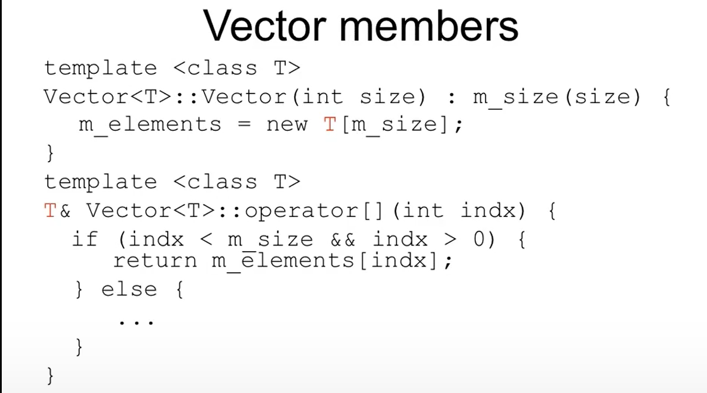

类模板里面的每一个函数都是函数模板, 并且在这些函数名称里面, 那个类的名字中间也要加上<T>