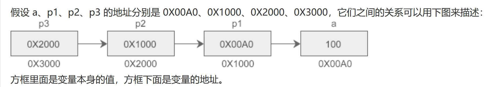

##### 如何表示地址?

地址是整数, 是否可以用 int? (理论上可以, )

但是为了强调它是个内存地址, 提出一些新的类型.


char* : 表示一个char型变量的地址

short* : 表示一个short型变量的地址

int* : 表示一个int型变量的地址

float* : 表示一个float型变量的地址

double* :表示一个double型变量的地址

unsigned char* : 表示一个unsigned char型变量的地址

...

XXX* : 表示一个XXX型变量的地址


- 以下以int型变量为例:

  ```c
  int a;
  int* pa = &a;
  ```

  

> 定义一个变量pa, 类型为int*, 初始值为&a; 

有两种叫法: 

(1) pa 指向一个int型变量

(2) pa 所在的内存是一个int型变量


我们称 int* 为指针类型, pa为指针类型的变量 (指针)


指针也是变量, 是可以变的

可以把它视为相应的变量


8位2进制, 就是2位16进制, 就是这样的生活的说. 我们还是必须要知道的说.


(3) 不同类型的指针, 不能互相赋值

e.g.1

```c++
#include <stdio.h>

int main()
{
	int a = 10;
	int* pa = &a;
	double* pb = &a;
	
	return 0;
}
```

```c++
C:\Users\duoduo.liu\Music\CProject\main.cpp(7) : error C2440: 'initializing' : cannot convert from 'int *' to 'double *'
        Types pointed to are unrelated; conversion requires reinterpret_cast, C-style cast or function-style cast
```

int* 指向int型变量, double* 指向double型变量, 肯定不能互相赋值

e.g.2

```c++
#include <stdio.h>

int main()
{
	char a = 78;
	float* p = &a; // 错: 左侧为float* , 右侧为 char* , 不能赋值成功

	return 0;
}
```


#### 关于指针

(4) * 星号的位置

以下几种都可以, 没有区别, 比较自由

```c++
int* p; // 靠近类型
int *p1; // 靠近变量
int * p2; // 甚至换行都可以
```


```c++
#include <stdio.h>

int main()
{
	int a = 0;
	int* p = &a; // int* ,一个类型, p 是一个变量
	
	*p = 0x11;   // *, 是一个操作符, 操作地址
	*p = 0x1314; // 指正变量前面加上了*, 表示我们引用了这块内存

	return 0;
}
```


###### 星号操作:按地址访问

有一个指针变量p, 则*p用于访问p指向的变量(p指向的内存)

或者称作: *p用于访问p指向的内存(读\写)


##### 星号操作: 更多练习

是区分: 指针定义语句中的 * 和 按地址访问的 *

```c++
int a = 10;
int b = 11;
int* p; // 定义一个指针, 注意 int* 作为一个整体
p = &a; // p指向a
printf("%d\n", *p); // *p: 取得p处内存的值
p = &b; // p指向b
printf("%d\n", *p); // *p: 取得p处内存的值
```

 

虽然说指针是一种整数类型, 但是它是特殊的, *号只能作用于指针类型.


### 小结

1. 提出新的类型 char* / short* / int* ... 用于表示某型变量的地址.

   ```c++
   int* p = &a; // p指向变量a, 或p指向a的内存
   ```

2.  学习按地址访问: 星号操作

   ```c++
   *p = 1234;
   int b = *p;
   ```


# 补充

关于p变量， 和&p

```c++
int n  = 5;
int* p = NULL;
p 	   = &n;

printf("&n = %p\n", &n);
printf("p  = %p\n", p);
printf("&p = %p\n", &p);
```

res:

```
&n = 003CFD98
p  = 003CFD98
&p = 003CFD8C
```

可知， p的值为n的地址，&p的值为p的地址， p是一个变量，其中保存的值是对应数据类型的地址。

e.g.

```c
    int a =100;
    int *p1 = &a;
    int **p2 = &p1;
    int ***p3 = &p2;
    printf("%d, %d, %d, %d\n", a, *p1, **p2, ***p3);
    printf("&p2 = %#X, p3 = %#X\n", &p2, p3);
    printf("&p1 = %#X, p2 = %#X, *p3 = %#X\n", &p1, p2, *p3);
    printf(" &a = %#X, p1 = %#X, *p2 = %#X, **p3 = %#X\n", &a, p1, *p2, **p3);
```




# 二级指针使用malloc进行分配

```c
#include <stdio.h>
#include <stdlib.h>

int main()
{
	int** p = NULL;
	int a = 5;
	int* p1 = &a;

	// 函数功能是开辟内存, 单位是字节
	p = (int**)malloc(sizeof(int*)); // 分配二级指针
	if (p)
	{
		*p = (int*)malloc(sizeof(int)); // 分配二级指针对应的每个一级指针
		if (*p)
		{
			**p = 5;
			printf("**p = %d\n", **p);
			free(*p);
			free(p);
		}
		else
		{
			printf("No memory for it again!\n");
		}
	}
	else
	{
		printf("No memory for it!\n");
	}
	
	return 0;
}
```


修改*pplist, 即修改plist指向的内存地址，

`   (*pplist)->pfront = NULL;
		(*pplist)->prear = NULL;
		(*pplist)->count = 0;`

然后可以修改对应的值

```c
int ListInit(List **pplist) // pplist --->> pList
{
	*pplist = NULL;
	*pplist = (List*)malloc(sizeof(List));
	if (*pplist == NULL)
	{
		return 0;
	}
	else
	{
		(*pplist)->pfront = NULL;
		(*pplist)->prear = NULL;
		(*pplist)->count = 0;
	}
	return 1;
}
```

// That is very interesting, and use it, we could finally know the process of pointer 


# 函数指针

```c
#include <stdio.h>
#include <stdlib.h>

void fun(int a, int b);

int main()
{
	void(*pfun)(int, int); // pfun为函数指针
	pfun = fun;

	return 0;
}

void fun(int a, int b)
{
	printf("a = %d, b = %d\n", a, b);
}
```

