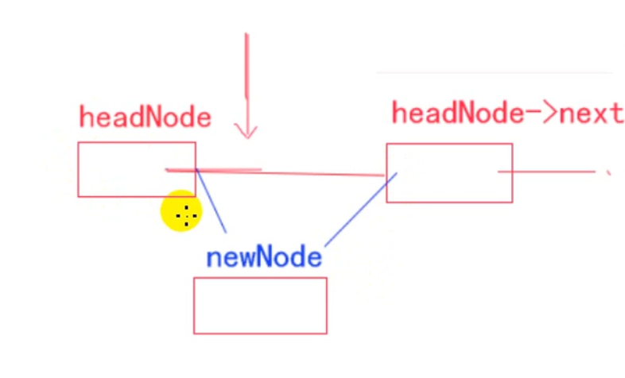
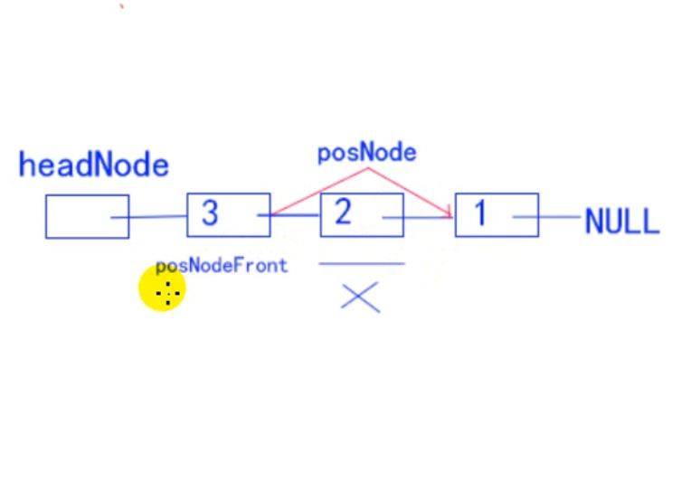

# 链表


本来指向NULL的指针， 指向下一个结构体。


- 静态链表

  ```c
  struct Node Node1 = {1, NULL};
  struct Node Node2 = {2, NULL};
  struct Node Node3 = {3, NULL};
  Node1.next = &Node2;
  Node2.next = &Node3;
  
  // 静态链表
  struct Node* pNode = &Node1;
  for (int i = 0; i < 3; i++)
  {
      printf("data is %d\n", pNode->data);
      pNode = pNode->next;
  }
  pNode = NULL;
  ```

  

- 什么是链表？ 链表是结构体变量和结构体变量连接在一起
- 通过指针连接在一起


# 动态创建链表


- 动态申请内存 + 模块化设计

  1. 创建链表（创建一个表头表示整个链表）
  2. 创建节点
  3. 插入节点
  4. 删除节点
  5. 打印遍历链表（测试）

  

  

- 头插法的具体实现步骤：




```c
#include <stdio.h>

// 链表的节点组成是这两个部分, 数据域 和 指针域
struct Node
{
	int data;	// 数据域 
	struct Node* next; // 指针域
};

// 链表就是这样一些结构体变量连在一起
// 创建链表表头
struct Node* creatList()
{
	struct Node* headNode = (struct Node*)malloc(sizeof(struct Node));
	headNode->next = NULL;
	return headNode;
}

// 创建链表节点
struct Node* createNode(int data)
{
	struct Node* node = (struct Node*)malloc(sizeof(struct Node));
	node->data = data;
	node->next = NULL;
	return node;
}

// 打印节点
void printList(struct Node* headNode)
{
	struct Node* pMove = headNode->next;
	while (pMove)
	{
		printf("%-7d", pMove->data);
		pMove = pMove->next;
	}
	printf("\n");
}

// 插入节点, 插入哪个链表, 插入节点的数据是多少
void insertNodeByHead(struct Node* headNode, int data)
{
	// 1. 创建插入的节点
	struct Node* newNode = createNode(data);
	newNode->next = headNode->next;
	headNode->next = newNode;
}

int main(void)
{
	// Actually, I think the USA is the best one. And we could do that kind of thing
	struct Node* headNode = creatList();
	insertNodeByHead(headNode, 1);
	insertNodeByHead(headNode, 2);
	insertNodeByHead(headNode, 3);
	printList(headNode);

	return 0;
}
```


# 链表的删除- 指定位置删除




内存4区:

1. 代码区: 函数代码, 存放在代码区, 函数名就是函数的地址. 
2. 全局区: 用来存放全局变量(不用初始化, int a,  自动会初始化为0), 字符串常量
3. 栈: 栈区的大小, 一般都在5M-10M之间, 如果定义变量总是 int b; int c; 就会出现问题.

​		int double char... 定义一个变量, C系统开辟, 释放

4. 堆: 计算机在该处分配的空间最多. 

   ​	自己确定有多大, 装什么数据, 用完之后还需不需要继续使用? 

   ​	自己需要决定 开辟 释放

   malloc free 
   
   new delete
   
    	#include <stdlib.h>


栈区的空间好比, 银行的板凳, 你走了, 相应的人就会自动坐上去;

堆区的空间, 就好比租房子, 你不用的话, 必须要退掉, 才会进行下一次的使用中, 所以不再使用的话, 需要释放该空间.


- 数据结构:

  用一套具体的方法管理内存, 达到高效, 有序.

- 链表, 就是数据结构中的一种.

  - 注意:

    面向过程, 面向对象 只是思维方式的不同, C 也是可以实现面向对象, 只不过不如具体的其他面向对象的语言写起来方便


链表: 数据结构, 

结点: 内存.

数据: 其中的数据.


