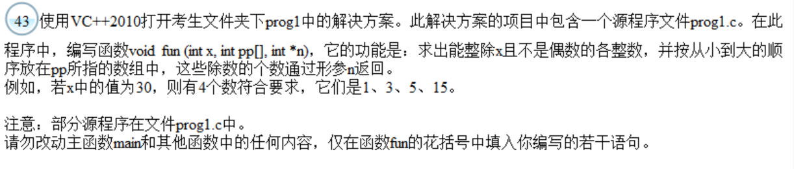

```c++
void fun (int x, int pp[], int *n)
{
	int i,j=0;
	for(i=1;i<=x;i=i+2)/*i的初始值为1，步长为2，确保i为奇数*/
		if(x%i==0)/*将能整除x的数存入数组pp中*/
		pp[j++]=i;
	*n=j;/*传回满足条件的数的个数*/
}

void main ()
{ 
  FILE *wf;
  int  x,aa[1000], n, i ;
  system("CLS");
  printf("\nPlease enter an integer number : \n ") ;
  scanf ("%d", &x) ;
  fun (x, aa, &n) ;
  for (i=0 ; i<n ; i++)
      printf ("%d ", aa [i]);
  printf ("\n ") ;
/******************************/
  wf=fopen("out.dat","w");
  fun (30, aa, &n) ;
  for (i=0 ; i<n ; i++)
      fprintf (wf,"%d ", aa [i]);
  fclose(wf);
/*****************************/
}
```


My version:

```c++
void fun (int x, int pp[], int *n)
{
    int j = 0;
    for (int i = 1; i <= x; i++)
    {
        if (x % i == 0 && i % 2 != 0)
        {
            pp[j++] = i;
        }
    }
    *n = j;
}
```

