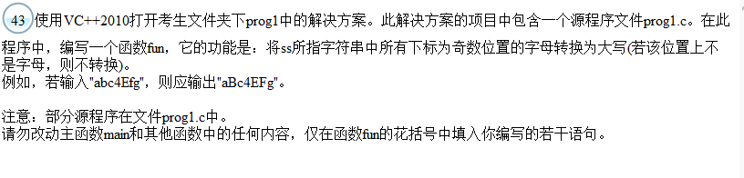

题目:


```c++
#include<conio.h>
#include<stdio.h>
#include<string.h>
#include<stdlib.h>
void fun(char *ss)
{
 int i;
  for(i=0;ss[i]!='\0';i++)                    /*将ss所指字符串中所有下标为奇数位置的字母转换为大写*/
     if(i%2==1&&ss[i]>='a'&&ss[i]<='z')   
        ss[i]=ss[i]-32;
}
void main()
{
  FILE *wf;
  char tt[81],s[81]="abc4Efg";
  system("CLS");
  printf("\nPlease enter an string within 80 characters:\n");
  gets(tt);
  printf("\n\nAfter changing, the string\n  %s",tt);
  fun(tt);
  printf("\nbecomes\n %s\n",tt);
/******************************/
  wf=fopen("out.dat","w");
  fun(s);
  fprintf (wf,"%s",s);
  fclose(wf);
/*****************************/
}
```



