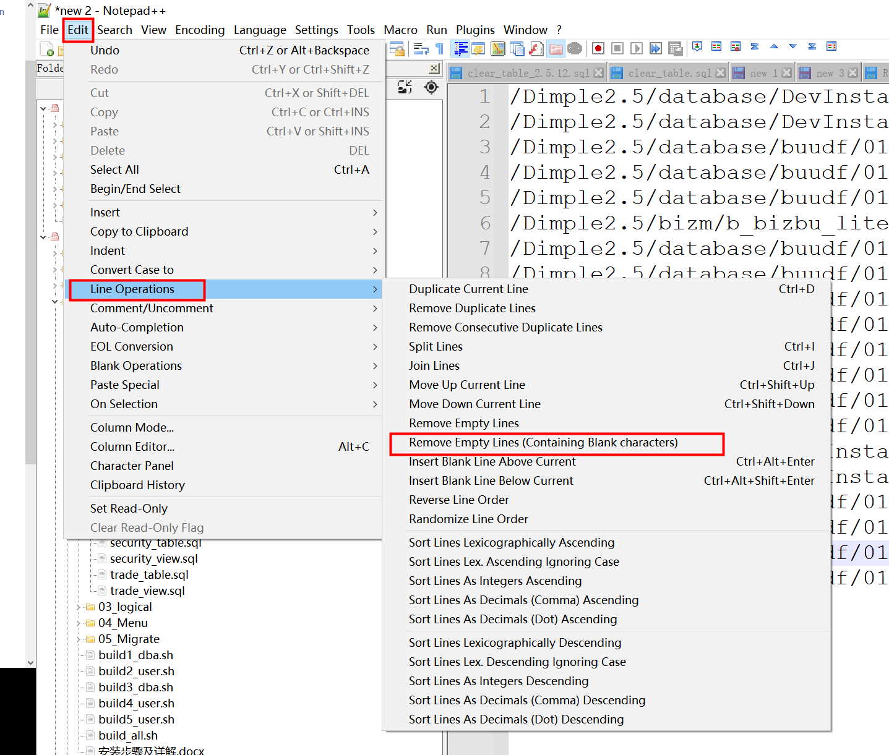

Edit->Line Operations-> Remove Empty Lines(Containing Blank characters)

> references: https://jingyan.baidu.com/article/a17d5285c4ac378099c8f276.html#:~:text=1.%20%E7%94%A8Notepad%2B%2B%E6%89%93%E5%BC%80%E5%AD%98%E5%9C%A8%E7%A9%BA%E7%99%BD%E8%A1%8C%E7%9A%84%E6%96%87%E4%BB%B6%EF%BC%8C%E6%8C%89%E4%B8%8BCRTL%2BA%E9%80%89%E6%8B%A9%E5%BD%93%E5%89%8D%E6%96%87%E4%BB%B6%E7%9A%84%E5%85%A8%E9%83%A8%E5%86%85%E5%AE%B9.%202.%20%E5%9C%A8%E8%8F%9C%E5%8D%95%E6%A0%8F%E4%B8%AD%E6%89%BE%E5%88%B0%E3%80%90%E7%BC%96%E8%BE%91%E3%80%91--%3E%E3%80%90%E8%A1%8C%E6%93%8D%E4%BD%9C%E3%80%91--%3E%E3%80%90%E7%A7%BB%E9%99%A4%E7%A9%BA%E7%99%BD%E8%A1%8C%EF%BC%88%E5%8C%85%E6%8B%AC%E7%A9%BA%E7%99%BD%E5%AD%97%E7%AC%A6%29%E3%80%91%EF%BC%8C%E5%8F%AF%E4%BB%A5%E5%B0%86%E6%89%80%E6%9C%89%E7%9A%84%E7%A9%BA%E7%99%BD%E8%A1%8C%E5%88%A0%E9%99%A4.,3.%20%E5%A6%82%E6%9E%9C%E6%83%B3%E8%A6%81%E4%BF%9D%E7%95%99%E4%B8%80%E4%B8%AA%E7%A9%BA%E7%99%BD%E8%A1%8C%EF%BC%8C%E5%8F%AF%E4%BB%A5%E4%BE%9D%E6%AC%A1%E9%80%89%E6%8B%A9%E3%80%90%E7%BC%96%E8%BE%91%E3%80%91--%3E%E3%80%90%E8%A1%8C%E6%93%8D%E4%BD%9C%E3%80%91--%3E%E3%80%90%E7%A7%BB%E9%99%A4%E7%A9%BA%E7%99%BD%E8%A1%8C%E3%80%91.%203.%20%E6%9C%AC%E9%A1%B5%E9%9D%A2%E9%9D%9E%E6%B3%95%E7%88%AC%E5%8F%96%E8%87%AA%E7%99%BE%E5%BA%A6%E7%BB%8F%E9%AA%8C.%204.

