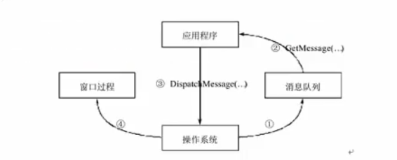
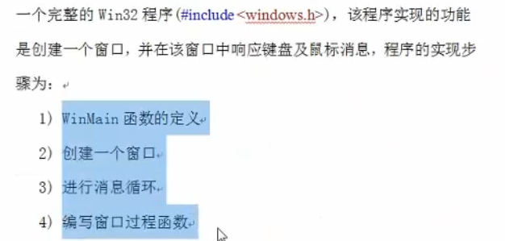

# 句柄

在Windows应用程序中, 窗口是通过窗口句柄(HWND)来标识的.

我们要对某个窗口进行操作, 首先就要得到这个窗口的句柄.

句柄(Handle)是Windows程序中一个重要概念. 在Windows程序中, 有各种各样的资源(窗口, 图标, 光标, 画刷等), 系统在创建这些资源时会为它们分配内存, 并返回标识这些资源的标识号, 即句柄.

在后面我们还会看到图标句柄(HICON), 光标句柄(HCURSOR), 画刷句柄(HBRUSH)

# 消息与消息队列

Windows程序设计的方法, 它是一种事件驱动方式的程序设计模式, 主要是基于消息的.

例如， 当用户按下鼠标左键， 首先是操作系统感知到这一事件，于是将这一事件包装成一个消息， 投递到应用程序的消息队列中，应用程序再将消息分发到操作系统， 由操作系统调用程序中一个专门负责处理消息的函数，这个函数就是窗口过程。

# WinMain函数

当Windows操作系统启动一个程序时，它调用的就是该程序的WinMain函数（实际上是由插入到可执行文件中的启动代码调用的）

WinMain函数是Windows程序的入口点函数， 当WinMain函数结束或返回时，Windows应用程序结束。

# Windows编程模型

