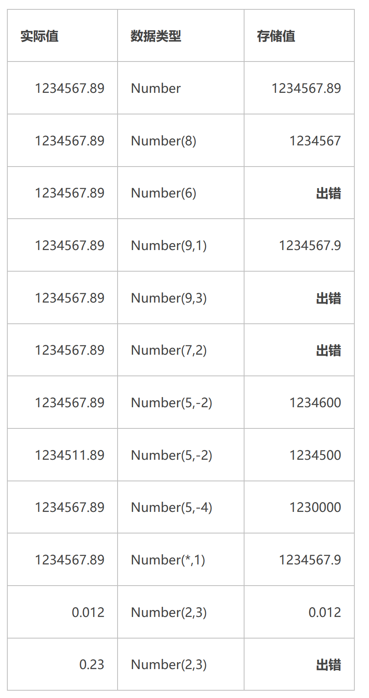

https://www.cnblogs.com/oumyye/p/4448656.html

**8.**  **关于precision， scale也可以作如下表述**

**定点数的精度(p)和刻度(s)遵循以下规则：**

\1) 当一个数的整数部分的长度 > p-s 时，Oracle就会报错

\2) 当一个数的小数部分的长度 > s 时，Oracle就会舍入。

\3) 当s(scale)为负数时，Oracle就对小数点左边的s个数字进行舍入。

\4) 当s >= p 时, p表示小数点后第s位向左最多可以有多少位数字，如果大于p则Oracle报错，小数点后s位向右的数字被舍入

与int的区别

oracle本来就没有int类型，为了与别的数据库兼容，新增了int类型作为number类型的子集。
int类型只能存储整数;
number可以存储浮点数，也可以存储整数；
number(8,1)存储小数位为1位，总长度为8的浮点数，如果小数位数不足，则用0补全；
number(8)存储总长度为8的整数；
int相当于number(22),存储总长度为22的整数。

e.g.

**NUMBER** **（ precision， scale）**

1.  **precision****表示数字中的有效位;如果没有指定precision的话，Oracle将使用38作为精度。**
2.  **如果scale大于零，表示数字精确到小数点右边的位数；scale默认设置为0；如果scale小于零，Oracle将把该数字取舍到小数点左边的指定位数。**
3.  **Precision****的取值范围为【1---38】；Scale的取值范围为【-84---127】。**
4.  **NUMBER****整数部分允许的长度为（precision- scale），无论scale是正数还是负数。**
5.  **如果precision小于scale，表示存储的是没有整数的小数。**
6.  **Precision****表示有效位数，****有效数位：从左边第一个不为0的数算起，小数点和负号不计入有效位数****；scale表示精确到多少位，指****精确到小数点左边或右边多少位(+-决定)****。**
7.  **Number****值类型举例：**